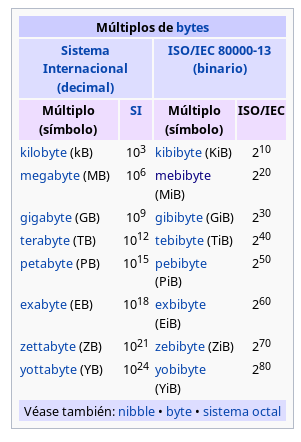

# Tarea : Operaciones Lógicas y Múltiplos

Realiza las operaciones indicadas con los números que se piden.

Pasos :

1. Pasar el número a *binario*.
2. Realizar la operación.
3. Pasar el resultado a *decimal*.

## Ejercicio 0 (Ejemplo)

21 & (AND) 7

$21_{10}$ = $10101_2$

$7_{10}$ = $111_2$

$10101$ && $111$ = $00101$

$00101_{2}$ = $5_{10}$

Solución:

21 & 7 = 5 

## Ejercicio 1 

* 14 | (OR)  4 
* 1 & (AND)  3 
* 13 XOR 15
* 15 XOR 10
* 32 & 63
* 31 & 12
* 42 & 56
* 85 & 128
* 127 & 34
* 255 | 123
* 256 XOR 512
* 512 XOR 511
* 255 XOR 345

## Ejercicio 2

Pasar las cantidades de la columna de la izquierda a las de la derecha.

Seguir las indicaciones de la tabla siguiente:

\ 

¡Atent@s a los múltiplos!

| Original | Nueva magnitud |
| -------------- | -------------- |
| 20 MiB | KiB |
| 12 MB | B |
| 21 KiB | MiB |
| 1200 KiB | MiB |
| 123 GB | MB |
| 1 MiB | KiB|
| 1 MB | KB |
| 2048 KiB | MiB | 
| 4096 MiB | GiB |
| 2,341 EB | GB |
| 5,512 ZB | TB |

