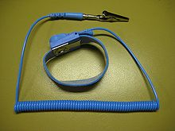
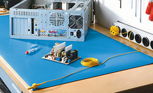
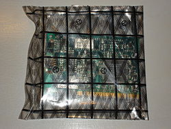

# Tarea : Precauciones

Prevención de riesgos laborales

En el montaje y desmontaje de los equipos informáticos se trabaja con componentes sometidos a tensión eléctrica, se manejan superficies cortantes, herramientas puntiagudas, etc., con lo que existe el riesgo de sufrir un accidente. Por ello, es fundamental cumplir las medidas establecidas en materia de prevención de riesgos laborales.
Conceptos básicos

La Ley 31/1995, de Prevención de Riesgos Laborales determina estos conceptos:

- Prevención: Es el conjunto de actividades o medidas adoptadas o previstas en todas las fases de atividad de la empresa con el fin de evitar o disminuir los riesgos derivados del trabajo.

- Riesgo Laboral: Es la posibilidad de que un trabajador sufra un determinado daño derivado del trabajo.

- Daños derivados del trabajo: Son las enfermedades, patologías o lesiones sufridas con motivo u ocasión del trabajo.

- Condiciones de trabajo: Cualquier característica del trabajo que pueda tener una influencia significativa en la generación de riesgos para la seguridad y la salud del trabajador. En concreto:

    Las características generales de los locales, instalaciones, equipos, productos y demás útiles existentes en el centro de trabajo.
    La naturaleza de los agentes físicos (ruido, temperatura, iluminación, etc.), químicos y biológicos presentes en el ambiente de trabajo y sus intensidades y niveles de presencia.
    Los procedimientos para la utilización de los agentes citados que influyan en la generación de los riesgos mencionados.
    Todas aquellas otras características del trabajo, incluidas las relativas a su organización y ordenación, que influyan en la magnitud de los riesgos a que esté expuesto el trabajador.

## Normativa de prevención de riesgos laborales

El marco normativo de la prevención de riesgos laborales en nuestro país viene determinado, en primer lugar, por la Constitución Española de 1978, norma fundamental de nuestro ordenamiento jurídico, que en su artículo 40.2 exige a los poderes públicos que velen por la seguridad e higiene en el trabajo.

En desarrollo del mandato de la Constitución, el Estatuto de los Trabajadores (Real Decreto Legislativo 1/1995) establece, en su artículo 19, el derecho de los trabajadores a una protección eficaz en materia de seguridad e higiene.

El tercer eje sobre el que pivota esta normativa es la Ley 31/1995, de 8 de noviembre, de Prevención de Riesgos Laborales, así como la normativa complementaria o que se ha dictado para desarrollarla.
Técnicas de prevención

En la tarea de prevención de riesgos intervienen diversas técnicas:

- Seguridad: Conjunto de técnicas que actúan sobre las causas de los riesgos para eliminarlos o reducirlos. Se dividen en:

    Medidas de prevención: tienen por objeto eliminar o reducir los riesgos, actuando sobre sus causas. Por ejemplo, utiliza materiales ignífugos en el lugar de trabajo.
    Medidas de protección: cuando no es posible eliminar los riesgos, tienen por objeto, proteger a los trabajadores. Por ejemplo, si en el lugar de trabajo no es posible utilizar materiales ignífugos, se debe proporcionar suficiente material contra incendios por si se produce uno.

- Higiene: Son las técnicas que estudian los riesgos físicos, químicos y biológicos que se dan en el lugar de trabajo para evitar que perjudiquen la salud del trabajador.

- Ergonomía: Tiene por objeto adaptar las condiciones de trabajo a las características personales de cada trabajador.

- Psicosociología: Engloba las técnicas que tratan de evitar los daños psicológicos que se pueden causar al trabajador (por ejemplo, estrés) a consecuencia de la organización del trabajo.
Medidas de prevención

El empresario debe llevar a cabo su acción preventiva de los riesgos laborales de acuerdo a unos principios. Los más importantes son:

- Evitar los riesgos: Si se elimina el riesgo, se evita la posibilidad de que se produzca un daño a causa del mismo. Por ejemplo, si en vez de ubicar un taller en el sótano, se ubica a nivel de calle, se evita el riesgo de caída por las escaleras.

- Evaluar los riesgos que no se pueden evitar: Por ejemplo, si se debe trabajar tecleando constantemente en un computador, habrá que ver qué riesgos se derivan de esa actividad y tomar las medidas preventivas necesarias.

- Combatir los riesgos en su origen: Por ejemplo, si en un taller hace mucho frio, se debe colocar una calefacción para hacer que suba la temperatura, en vez de decirle a los trabajadores que se abriguen.

- Adaptar el trabajo a la persona: En lo que respecta a la concepción de los puestos de trabajo y en la elección de los equipos y los métodos de trabajo y de producción, para atenuar el trabajo monótono y repetitivo y reducir los efectos del mismo en la salud.

- Sustituir lo peligroso por lo que entrañe poco o ningún peligro: Aunque se a más caro.

- Planificar la prevención: El empresario deberá realizar una evaluación inicial de los riesgos existentes por puesto de trabajo. Dicha evaluación se actualizará siempre que cambien las condiciones de trabajo y habrá de someterse a revisión en caso de que se produzcan daños a la salud del trabajador.

- Dar las debidas instrucciones a los trabajadores: respecto a los riesgos existentes en el lugar de trabajo.

- Uso de casco por las noches cuando hayan apagones está aún pendiente de aprobación en la nueva norma vigente EGI1445
Medidas de protección

En caso de que no sea posible eliminar los riesgos, estas medidas son las que permiten evitar o disminuir sus consecuencias. Podemos diferenciar entre medidas colectivas e individuales.
Medidas de protección colectiva

Este tipo de medidas son las que protegen a todos los trabajadores expuestos al riesgo, actuando en el origen de este. Por ejemplo, en un taller informático situado en un altillo, una medida de protección colectiva sería una barandilla que impidiera que ninguno de los trabajadores cayera al piso inferior.

Dependiendo de las circunstancias especiales de cada puesto de trabajo, habrá distintas medidas de este tipo (por ejemplo, plataformas para evitar caídas a fosos, extractores de humo, etc.).
Señalización de seguridad

Con caracter general, una de las medidas de protección colectiva más importantes es la señalización de seguridad. Esta materia está regularizada en el Real Decreto 485/1997, de 14 de abril, según el cual, la señalización de seguridad y salud en el trabajo es:

Una señalización que, referida a un objeto, actividad o situación determinadas, proporcione una indicación o una obligación relativa a la seguridad o la salud en el trabajo mediante una señal en forma de panel, un color, una señal luminosa o acústica, una comunicación verbal o una señal gestual, según proceda.

Existen diferentes tipos de señales:

- Visuales: Son señales en forma de panel que combinan formas geométricas y colores para transmitir un mensaje (por ejemplo, un pictograma blanco sobre fondo azul indica obligación, un pictograma negro sobre fondo amarillo y con bordes negros indica peligro, etc.).

- Acústicas: Son señales sonoras emitidas y difundidas por medio de un dispositivo apropiado (por ejemplo, una sirena).

- Verbales: Es un mensaje verbal predeterminado, en el que se utiliza voz humana o sintética. Deberán ser claros, simples y cortos.

- Gestuales: Son movimientos o disposiciones de los brazos o manos para guiar a las personas que estén realizando maniobras que constituyan un riesgo o peligro para los trabajadores.
Medidas de protección individual

Según el Real Decreto 773/1997, de 30 de mayo, sobre disposiciones mínimas de seguridad y salud relativas a la utilización por los trabajadores de equipos de protección individual, que es la norma que los regula, los equipos de protección individual (EPI) son aquellos equipos destinados a ser llevados o sujetados por el trabajador con la finalidad de que le protejan de uno o varios riesgos que puedan amenzar su seguridad o su salud.

Se considerarán también como tales los complementos o accesorios destinados a tal fin. Los EPI deben cumplir varios requisitos:

- Eficacia en la protección frente a los riesgos que motivan su uso, debiendo ser capaces de responder a las condiciones del lugar de trabajo.

- Inocuidad. No deben suponer por sí mismos u ocasionar riesgos adicionales ni molestias innecesarias al trabajador.

- Ergonomía. Deben adaptarse a las condiciones anatómicas y fisiológicas del trabajador y a su estado de salud.

- Homologación con la marca de conformidad CE.

- Serán de uso general siempre que sea posible. Si las circunstancias exigiesen la utilización de un equipo por varias personas, se adoptarán las medidas necesarias para que ello no origine ningún problema de salud o de higiene a los diferentes usuarios.

Los equipos de protección individual utilizados en el montaje y mantenimiento de equipos informáticos son los siguientes:

- Protección de los ojos. Pantallas faciales o gafas con protección lateral para evitar impactos de materiales proyectados mientras se está efectuando el montaje. Deben tener tratamiento antivaho para que no se empañen.

- Protección de oídos. Tapones u orejeras.

- Protección de las manos. Guantes. Los útiles y herramientas que se utilizan en el trabajo, a menudo, son instrumentos cortantes o puntiagudos (cúteres, destornilladores, etc.). Por ello, los guantes deben ser resistentes a cortes, perforación o rasgado.

- Protección de pies. Calzado de protección. Los riesgos que se pueden producir en el trabajo de un técnico informático son los siguientes:

    Riesgos mecánicos. Caídas de objetos o herramientas en los pies (por ejemplo un computador, un destornillador, etc.). El calzado debería tener refuerzos antiperforación y antigolpes.
    Riesgos eléctricos. Descargas en la manipulación de componentes eléctricos. Se usaría calzado aislante.
    Riesgos electrostáticos. Son los derivados de la electricidad estática. En un técnico informático son especialmente importantes, no solo por su propia seguridad sino también por la de los equipos con los que trabaja.

- Protección del cuerpo. Si bien no es imprescindible sí es muy recomendable el uso de batas a la hora de manipular equipos, ya que la higiene es una de las primeras medidas preventivas. Si se tiene que cargar a menudo con equipos pesados, puede ser recomendable utilizar una faja para evitar lesiones en la espalda.

# Prevención de riesgos en el montaje y mantenimiento de equipos

Cargas Electrostáticas

.svg.png)
\

Etiqueta ESD (Susceptible)

\

Pulsera antiestática.

\

Accidente del Hindenburg por ESD

La energía estática puede hacer que se dañen los componentes electrónicos. La electricidad estática puede producir descargas de 4000 o incluso más voltios que hacen que se estropee un componente electrónico. 

Muchas de estas descargas (ESD) que se producen no son visibles al ojo humano.

\

Los rayos son ESD.

\

Mantel antiestático conectado a toma tierra

## Acciones que evitan problemas con la energía estática:

Tocar un grifo (las tuberías cuando son metálicas hacen de toma de tierra) o tocar el agua de un grifo
Tocar continuamente la parte metálica de la carcasa para descargarse pues están conectadas al toma a tierra.
Utilizar una pulsera de toma de tierra y utilizarla correctamente.
Utilizar un spray antiestático. Rociar un trapo con el spray, frotar el monitor, la caja y el teclado pues aumentan la humedad y la electricidad estática circula hasta tierra.
Usar ropa y calzado no generador de cargas electrostáticas, como algodón, tejidos antiestáticos, suela de cuero o con aditivos conductores.
Emplear suelos semi-conductores, cerámica, hormigón, etc. Evitar polímeros y moquetas o, en su defecto, usar alfombrillas antiestáticas ante equipos y mobiliario metálico, etc.

\
Dispositivo con una bolsa antiestática.

 
* Acciones que pueden provocar problemas con la energía estática (HAY QUE EVITAR):
* Utilizar zapatos con suela de goma
* Utilizar pulseras conductoras (metálicas), anillos, piercing, etc.
* No descargarse estáticamente mientras se está trabajando.

## Trabajo con instalaciones eléctricas

Posiblemente, los riesgos más graves a los que se exponen quienes trabajan con equipos informáticos son los riesgos eléctricos. Los equipos informáticos necesitan energía eléctrica para funcionar y, por ello, contienen condensadores de alto voltaje (220 v) que pueden causar una descarga eléctrica grave si se tocan. Estos elementos pueden permanecer cargados incluso cuando el equipo ya no está enchufado y son capaces de provocar descargas eléctricas fatales. En concreto, la energía eléctrica presente en los equipos informáticos genera los siguientes riesgos:

- Electrocución por contacto directo (por ejemplo, generado al tocar la fuente de alimentación) o indirecto (por ejemplo, ocasionado si se toca la carcasa del computador y está accidentalmente en contacto con algún elemento de tensión). Esta electrocución puede causar quemaduras y paradas cardiorespiratorias o golpes y caídas a consecuencia de la descarga.

- Incendios a consecuencia de sobreintensidades o sobretensiones de algunos dispositivos, como la fuente de alimentación.

Las medidas genéricas de prevención pasan por maximizar las precauciones y desconectar los equipos antes de manipularlos, comprobar el estado de las conexiones, cables y enchufes, etc. Como precauciones específicas podemos citar las siguientes:

- No manipular aparatos eléctricos con las manos húmedas o sudadas.

- No desconectar los equipos tirando del cable sino del conector.

- Alejar los cables de las fuentes de calor.

- Las tapas de los cuadros eléctricos deben permanecer cerradas y el peligro eléctrico debe estar señalizado.

- No alterar, ni modificar los dispositivos de seguridad: aislantes, carcasas de protección, etc.

- Utilizar cables y enchufes con toma de tierra.

- No enchufar demasiados dispositivos a enchufes múltiples.

En el interior de los equipos informáticos (excepto en algunos componentes como las fuentes de alimentación y los monitores) la tensión que circula es una corriente continua de unos pocos voltios (+5 v, -5 v, +3.3 v, +12 v, etc.). Una descarga de esta corriente no causará graves daños al trabajador, pero es suficiente para dañar o incluso destruir definitivamente algún componente informático. Por ello, siempre que se manipule un computador, este debe estar apagado y desenchufado de la corriente.

Por otro lado, una instalación eléctrica en malas condiciones puede provocar cortocircuitos e incendios. De hecho, el riesgo de incendio es uno de los más graves a los que están sujetos los talleres informáticos.

Las medidas más eficaces son las preventivas, para evitar que se produzca el incendio, revisando las instalaciones eléctricas periódicamente y extremando el orden y la limpieza con el fin de evitar la acumulación de materiales de fácil combustión y la propagación del fuego.

Asimismo, se debe contar con suficientes extintores en perfecto estado de uso y adecuados a la clase de fuego que se puede producir en estas instalaciones. Además se deben instalar sistemas de detección y alarma y señalizar y dejar libres las salidas de emergencia.

En el caso de los incendios que se pueden producir en un taller informático, los extintores apropiados son los de clase C (o ABC), de polvo seco polivalente o CO2. En este tipo de incendios, hay involucradas instalaciones eléctricas, por lo que, en ningún caso, deberá utilizarse el agua como elemento extintor por el riesgo de sufrir una descarga eléctrica. En todo caso, la primera medida será cortar la corriente en el interruptor diferencial.

En servidores que almacenan datos muy importantes, se debe tomar especial precaución con los sistemas contraincendios, debido al gran valor de los datos. En estas situaciones, se instalan equipos automáticos de extinción de incendios que no dañan a los equipos, como sensores de humo y temperatura, extractores de aire, etc.

## Dispositivos, generalidades

* Leer detenidamente el libro de instrucciones de cada dispositivo a utilizar.
* No desenchufar el cable de tensión cuando el equipo está funcionando. Puede ocurrir que dañes la fuente de alimentación y los demás componentes. Recuerda que un equipo suspendido o en stand-by está funcionando.
* No ubicar el equipo en un lugar con alta temperatura o humedad, ni junto a las ventanas ni lugares de paso.
* No tocar determinadas partes de los componentes con las manos.
* No forzar nunca los componentes al insertarlos en los conectores de la placa.
* No utilizar la fuerza a la hora de atornillar, fijar una memoria, insertar la placa en su zócalo, etc.
* Evitar el contacto de los líquidos con el equipo. En caso de que se derrame cualquier líquido sobre algún componente electrónico dejarlo secar algunos días en ambiente lo más seco posible.
* No utilizar secadores de pelo o similar. Se puede utilizar arroz para absorber la humedad. Muchos líquidos provocan cortocircuitos y oxidación.
* Evitar la acumulación de polvo en el interior de los equipos. Para eliminarlo utilizar un pincel suave, un aspirador pequeño o un spray limpiador específico para eliminar polvo de componentes electrónicos.
* Utilizar el sentido común.

### Microprocesador

* Evitar el funcionamiento del equipo con el microprocesador montado sin el disipador del microprocesador
* Cuando se cambie el disipador, se ha de limpiar la pasta térmica anterior, reponiendo la pasta térmica nuevamente antes de montar otra vez el disipador.
* Normalmente los disipadores de los microprocesadores tiene ya un material con pasta térmica preaplicado, si se decide utilizar otro tipo de material hay que consultar si es apropiado el utilizarlo o no en ese microprocesador.
* Nunca instalar un disipador en un microprocesador sin pasta térmica.
* Nunca manipular el procesador por los pines o patillas.

### Fuentes de alimentación

* Las fuentes de alimentación tienen altos voltajes en su interior (¡incluso después de desconectarlas!) debido a que sus condensadores internos que se descargan muy lentamente.. Con lo cual se aconseja mucho cuidado en su manipulación y si no se está seguro de lo que se hace, mejor, no tocar.

### Placa Base y Memoria

Una placa base viene protegida en su parte inferior por un material que impide que se deterioren los contactos situados en esa cara y se vende envuelta en una bolsa antiestática.

* No manipular la placa base por los componentes, siempre manipularla por los cantos.
* No manipular la placa de la bolsa hasta que haya que montarla, cuanto menos se manipule, mejor será.
* No colocar la placa encima de la bolsa puesto que puede haberse almacenado la carga electrostática en la zona externa.
* No apilar las placas una encima de otra pues se pueden dañar. Colocarlas encima de algún material aislante.

### Discos duros

* Manipular los discos duros a temperatura ambiente.
* La circuitería electrónica es muy sensible a la energía estática por lo tanto hay que manejar el disco por los cantos.
* Su uso debe ser preferentemente en posición horizontal.
* No tocar nunca la circuitería electrónica.
* No manipular ni golpear el disco cuando está conectado a la corriente pues las cabezas pueden dañar algún plato.
* No exponer los discos a fuentes magnéticas potentes pues dañan la información que contienen.
* No abrir el disco bajo ningún concepto.

## Trabajo con herramientas

El técnico informático está constantemente utilizando herramientas como alicates, martillos, destornilladores, tijeras, llaves, cuchillos, cúteres, etc. El uso de estas herramientas conlleva algunos riesgos:

- Golpes, cortes y pinzamientos en las manos producidos por las herramientas mientras se trabaja con ellas o con los propios equipos.

- Lesiones en los ojos, por partículas o elementos proyectados de los objetos con los que se trabaja o por las propias herramientas.

- Esguinces por sobre esfuerzos o gestos violentos.

- Descargas eléctricas procedentes de herramientas eléctricas en mal estado o que han sido incorrectamente manipuladas.

Las medidas preventivas genéricas que se deben observar respecto a las herramientas son las siguientes:

- Utilizar herramientas de buena calidad y con certificado CE.

- Seleccionar las herramientas adecuadas para cada trabajo y destinarlas al uso para el que han sido diseñadas.

- Verificar que el estado de conservación de las herramientas es el correcto antes de usarlas. Además, se debe revisar periódicamente el estado de las herramientas, aunque no se utilicen.

- Transportar las herramientas de forma segura.

- Guardar las herramientas ordenadas, limpias y en un lugar seguro.

Además de estas medidas genéricas, el Instituto Nacional de Seguridad e Higiene en el Trabajo (INSHT) ha publicado varias guías técnicas relativas al uso específico de cada herramienta. Las recomendaciones relativas a las principales herramientas manuales son:

- Alicates. No deben utilizarse en lugar de llaves, ya que las mordazas de los alicates son flexibles y frecuentemente resbalan. Además tienden a redondear los ángulos de las cabezas de los pernos y las tuercas, dejando marcas de las mordazas sobre las superficies. Se deben utilizar únicamente para sujetar, doblar o cortar teniendo cuidado de no colocar los dedos entre los mangos.

- Desarmador. Solo deben utilizarse para quitar tornillos (no como punzones o cuñas). Deben tener el mango en buen estado y amoldado a la mano con superficies laterales prismáticas. Su espesor, anchura y forma debe estar ajustado a la cabeza del tornillo a manipular. Se deben desechar los destornilladores que tengan el mango roto, la hoja doblada o la punta rota o retorcida, pues ello puede dar lugar a que se salga de la ranura originando lesiones en manos. Además, la pieza sobre la que se trabaja no se debe sujetar con las manos, sobre todo si es pequeña. En su lugar debe utilizarse un banco o superficie plana o bien sujetar la pieza con un tornillo de banco.

- Llaves. Existen dos tipos, llaves de boca fija y llaves ajustables (llaves inglesas). Las llaves deben mantenerse en buen estado, comprobando que la boca y los mecanismos están bien. Deben ser de dimensiones adecuadas al perno o la tuerca que se está apretando o aflojando. Se deben utilizar asegurándose de que ha ajustado perfectamente la tuerca y que forman ángulo recto con el tornillo, realizando la tracción hacia el operario, nunca empujando, asegurándose de que los nudillos no se golpean contra algún objeto.

- Tijeras. También son especialmente peligrosas, por ello, deben ser guardadas y transportadas dentro de una funda dura. Hay que evitar utilizar tijeras melladas. Se deben utilizar para cortar en dirección contraria al cuerpo y no usarlas nunca como martillo ni como destornillador.

- Cuchillos, cúteres, cuchillas, etc. Son muy peligrosos por el riesgo de corte que suponen. Deben utilizarse siempre en dirección contraria al cuerpo, adecuando el tipo de cuchilla a la superficie que se quiere cortar. Debe mantenerse un especial cuidado al guardarlos cuando no se usen, evitando que queden debajo de papel o trapos y puedan dar lugar a cortes accidentales. Deben ser almacenados y transportados en una funda dura.
Manejo de cargas

Es frecuente que el técnico informático tenga que cargar con equipos informáticos pesados, corriendo el riesgo de lesionarse. Para manipular correctamente estas cargas, deberá flexionar las rodillas y alzar el peso ejercitado la fuerza con las piernas y no con la espalda, que siempre debe estar recta.

Además, podrá ser conveniente el uso de un EPI específico (faja y calzado con puntera de acero, para proteger los pies si se cae un objeto sobre ellos).
Trabajo con pantallas de visualización de datos

Una de las tareas más habituales de los técnicos informáticos es el trabajo con pantallas de visualización. Los riesgos derivados de estas actividades son una falta de adecuación de los equipos a las circunstancias del trabajador que dan lugar a fatiga visual, física o mental. Una silla que no tiene la altura correcta puede ocasionar lesiones en la espalda y cuello; una mesa no situada a la altura correcta provocará sobrecargas musculares y podrá dar lugar a golpes en las piernas, etc.

Como medidas de prevención, habrá que mantener una postura adecuada frente al computador, adaptando el mobiliario en dimensiones y colocación a las características personales del trabajador.

Por otro lado, la permanencia durante mucho tiempo ante una pantalla de computador puede ocasionar fatiga visual. Las medidas adecuadas para evitarlas serán:

- Graduar el brillo y contraste del monitor.

- Utilizar una iluminación adecuada.

- Colocar la pantalla en paralelo con las fuentes de iluminación para evitar reflejos en la pantalla.

- Realizar paradas periódicas para descansar la vista, realizando ejercicios de enfoque visual (mirando cerca y lejos).

## Entorno de trabajo

Ante todo, es esencial contar con un entorno adecuado de trabajo: el área de trabajo debe estar bien iluminada, tener la temperatura apropiada y estar bien ventilada. Además se debe contar con una mesa o banco de trabajo cómodo y con una altura adecuada para no dañar la espalda. Estos trabajos obligan a mantener una misma postura durante bastante tiempo y, si esa postura es incorrecta, puede generar lesiones importantes a medio y largo plazo. Además, esta superficie debe estar seca, despejada y limpia.
Condiciones ambientales

Las condiciones ambientales (temperatura, humedad, ventilación y corrientes de aire) pueden ser una fuente de riesgos. En efecto, los trabajadores deben disfrutar en su entorno laboral de unas condiciones ambientales adecuadas al trabajo que están realizando.

Unas malas condiciones ambientales pueden producir diversas patologías (resfriados, desmayos por excesivo calor, etc.). Además, unas condiciones que no sean confortables pueden producir insatisfacción en el trabajador, con la consiguiente pérdida de concentración en su tarea.

Las medidas preventivas consistirán en proporcionar a los trabajadores unas adecuadas condiciones ambientales:

- La temperatura de los locales donde se realicen trabajos sedentarios debe estar comprendida entre 17 ºC y 27 ºC y, si se realizan trabajos ligeros, debe estar comprendida entre 14 ºC y 25 ºC.

- La humedad deberá estar entre el 30% y el 70%, excepto en el caso de que existan riesgos por electricidad estática (algo habitual en el trabajo de montaje informático), en que no podrá ser inferior al 50%.

- Además, los trabajadores no deberán estar expuestos de forma frecuente o continuada a corrientes de aire cuya velocidad exceda los siguientes límites: trabajos en ambientes no calurosos (0,25m/s), trabajos sedentarios en ambientes calurosos (0,5m/s), trabajos no sedentarios en ambientes calurosos (0,75m/s).
Iluminación

Si la iluminación es muy importante en todos los trabajos, en el del técnico informático este aspecto adquiere una importancia fundamental. Durante el montaje y desmontaje de equipos se llevan a cabo tareas de gran presión, por lo que una insuficiente iluminación puede dar lugar a accidentes al ensamblar equipos, así como a una incorrecta realización de las tareas que se están ejecutando.

Como medidas preventivas, la iluminación de cada zona o parte de un lugar de trabajo deberá adaptarse a las características de la actividad que se efectúe en ella, teniendo en cuenta los riesgos para la seguridad y salud de los trabajadores dependientes de las condiciones de visibilidad y las exigencias visuales de las tareas desarrolladas.

Además, siempre que sea posible, los lugares de trabajo tendrán una iluminación natural. Cuando la iluminación natural por sí sola no garantice unas condiciones adecuadas de visibilidad, deberá complementarse con iluminación artificial.

En tales casos, se utilizará preferentemente la iluminación general, complementándola con una iluminación localizada cuando en zonas concretas se requieran niveles de iluminación elevados (mediante flexos o apliques luminosos similares).

## Espacio de trabajo

Las condiciones del lugar de trabajo también son esenciales. Cada trabajador debe disponer de un espacio suficiente para llevar a cabo su tarea. En los trabajos que realizan un técnico informático, los equipos deben colocarse sobre una superficie limpia, despejada y con unas dimensiones adecuadas. Una superficie de trabajo inadecuada es fuente de diversos riesgos:

- Golpes o cortes con las herramientas o con los equipos a causa de un espacio insuficiente o por caída desde la superficie donde se está trabajando.

- Descargas eléctricas en caso de que la superficie esté húmeda.

- Golpes con los equipos almacenados de forma indebida, sin respetar unas adecuadas zonas de paso.

- Caídas a causa de suelos inestables o resbaladizos.

- Descargas de electricidad estática en suelos conductores de la electricidad.

Como medida de prevención, los lugares de trabajo, incluidos los locales de servicio, y siempre que sea necesario para mantenerlos en todo momento en condiciones higiénicas adecuadas. A tal fin, las características de los suelos, techos y paredes serán tales que permitan dicha limpieza y mantenimiento.

Se eliminarán con rapidez los desperdicios, las manchas de grasa, los residuos de sustancias peligrosas y demás productos de deshecho que puedan originar accidentes o contaminar el ambiente de trabajo.

## Riesgos organizativos y psicosociales

Finalmente, existe otro tipo de riesgos vinculados a las condiciones en que se lleva a cabo el trabajo. Estos riesgos, determinados por la carga de trabajo y por las circunstancias organizativas de la empresa pueden provocar estrés o desmotivación en el trabajador:

- Carga de trabajo. El INSHT la define como el conjunto de requerimientos físicos y mentales a los que se ve sometida la persona durante la jornada laboral. Si esta carga de trabajo es excesiva, el trabajador estará expuesto al riesgo de sufrir fatiga física o mental:

    Fatiga física: en los trabajos de montaje y reparación de equipos, cargas excesivas de trabajo pueden dar lugar a fatiga física por posturas forzadas durante mucho tiempo, manipulación de cargas excesivas, etc.
    Fatiga mental: puede aparecer en el trabajo del técnico informático, debido a lo minucioso de su trabajo, que exige gran capacidad de concentración.

- Organización del trabajo. Las tareas deben distribuirse de forma adecuada a las capacidades de cada trabajador y, en todo caso, el sistema de trabajo debe respetar las aptitudes y la dignidad de los trabajadores. La incorrecta distribución de las tareas conlleva la insatisfacción del trabajador que se manifiesta en la aparición de patologías como el estrés, el mobbing y el burnout. 

### Ejercicios

Responde a las siguientes preguntas en un documento. Copia el enunciado de las preguntas en el documento de respuestas.
Responde con *TUS PROPIAS PALABRAS*. En caso de que un documento sea una copia de algún lugar de internet y/o de otr@ alumn@
de la clase la nota final del ejercicio es un 0.

#### Ejercicio 01

Enuncia las herramientas que son própias de utilización en un taller de ordenadores que se han descrito en esta unidad. Puedes añadir aquellas que consideres que deberían estar y que no han sido tratadas).

#### Ejercicio 02 

Enumera y define brevemente los factores de riesgo en la instalación de componentes de un ordenador.

#### Ejercicio 03

¿Qué es la Electricidad Estática?¿Qué puede suceder cuando se produce una descarga electrostática sobre un componente electrónico?

#### Ejercicio 04

Define brevemente los riesgos eléctricos.

#### Ejercicio 05

Busca en PCComponentes 10 herramientas de trabajo que tengan la certificación europea.

Busca en AliExpress 10 herramientas de trabajo que NO TENGAN la certificación europea.

Compara Precios y prestaciones.

Realizalo en una tabla indicando:

| Nombre Componente | URL PCComponentes | URL AliExpress | Precio PCComponentes | Precio AliExpress |
| ----------------- | ------------------| -------------- | ---------------------| ----------------- |
