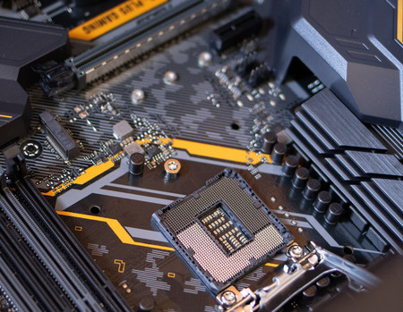
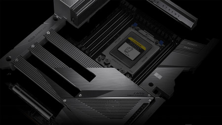
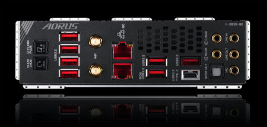
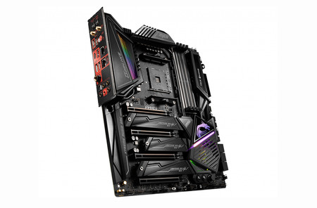
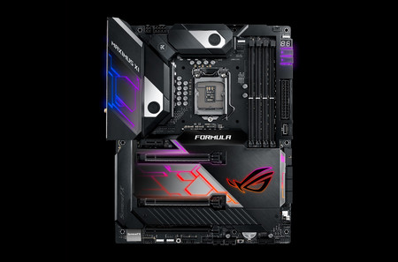

La placa base da forma, literalmente, a [los cimientos de nuestros
ordenadores](https://www.xataka.com/componentes/asi-se-fabrica-la-placa-base-de-tu-ordenador).
Los usuarios que no están familiarizados con el hardware no suelen darle
la importancia que merece porque se fijan más en otros componentes a
priori más llamativos, como la CPU o la tarjeta gráfica. Y es
comprensible que sea así, pero, en realidad, **el rol de la placa base
es crucial**. De hecho, en gran medida de ella dependen la estabilidad y
la capacidad de actualización de nuestro PC.

Los entusiastas del hardware no solo suelen prestar mucha atención a
este componente, sino que a menudo también le dedican una parte
importante de su presupuesto. Y tiene todo el sentido si tenemos
presente que una placa base a la última y de buena calidad **puede
permitirnos actualizar en el futuro** la mayor parte de los componentes
de nuestro equipo, incluido el procesador, sin necesidad de cambiarla.
Y, además, como veremos más adelante en este texto, puede tener [un
impacto profundo en nuestra
experiencia](https://www.xataka.com/basics/como-saber-cual-es-mi-placa-base-y-otros-componentes-de-mi-ordenador-en-windows).

# El chipset: el auténtico cerebro de la placa base

Poner a punto una placa base de calidad requiere un esfuerzo importante
en materia de ingeniería. De hecho, no cabe duda de que es uno de los
componentes más complejos de un ordenador. En este artículo indagaremos
con cierta profundidad en algunos de sus elementos, pero para ir
familiarizándonos con ella nos viene bien saber que en su estructura
básica destacan **la placa de circuito impreso**, o PCB (*Printed
Circuit Board*), que es el sustrato no conductor de la carga eléctrica
sobre el que se colocan los demás componentes; los circuitos integrados,
zócalos, condensadores y los demás dispositivos eléctricos y
electrónicos indispensables para que los subsistemas de la placa base
lleven a cabo su función; y, por último, las pistas o buses de material
conductor que se responsabilizan de transportar la información entre
unos componentes y otros.

El chipset de la placa base se responsabiliza de administrar el tráfico
de la información que intercambian algunos de los subsistemas de nuestro
PC

Entre todos estos componentes hay uno al que merece la pena que
prestemos mucha atención debido a que es el auténtico cerebro de la
placa base: **el chipset**. Identificarlo sobre la superficie del PCB es
sencillo porque suele ser el circuito integrado más grande de todos. Eso
sí, en las placas base actuales si queremos verlo tendremos que retirar
previamente el disipador que suele ocultarlo para ayudarle a evacuar con
eficacia la energía que disipa en forma de calor. En cualquier caso, más
allá de su tamaño y su complejidad, el chipset es importante debido a la
función que lleva a cabo: se responsabiliza de administrar el tráfico de
la información que intercambian algunos de los subsistemas de nuestro
PC.

Tradicionalmente **el chipset estaba constituido por dos circuitos
integrados**: el *northbridge* y el *southbridge*. De ahí su nombre
original (chipset en inglés significa 'conjunto de chips'). El primero y
más complejo de ellos, el *northbridge*, se encargaba esencialmente de
administrar el tráfico de datos entre la CPU, la memoria principal y el
subsistema gráfico. El otro chip, el *southbridge*, estaba conectado al
*northbridge* a través de un enlace de alto rendimiento y quedaba
relegado a controlar la comunicación con los demás subsistemas del
equipo, como las tarjetas que podíamos instalar en las ranuras de
expansión, los puertos USB y SATA, el chip de audio o la controladora de
red, entre otros dispositivos.

\

La razón por la que en el párrafo anterior he utilizado los verbos en
pasado, y no en presente, es que prácticamente todos los chipsets para
las placas base actuales **utilizan un solo circuito integrado**, y no
dos. Buena parte de la lógica que incorporaba en su interior el
*northbridge* ha pasado a estar integrada en el interior del encapsulado
de la CPU, por lo que ya no son necesarios los dos chips a los que
recurrían las placas base hace unos años. Con uno solo que lleve a cabo
esencialmente las tareas que desempeñaba el *southbridge* es suficiente.

Una consecuencia muy interesante que tiene la integración de la lógica
del *northbridge* en el procesador es que este último ahora está
conectado de forma directa mediante buses de alto rendimiento a la
memoria principal y la lógica gráfica externa. Ya no es necesario que
otro circuito integrado actúe como intermediario. Aun así, el chipset
sigue responsabilizándose de la administración del tráfico generado por
buena parte de los subsistemas de nuestros ordenadores, como son las
ranuras PCI Express que no están destinadas a la tarjeta gráfica o los
puertos SATA, USB y Thunderbolt, entre otras opciones. Por esta razón,
la comunicación entre la CPU y el **PCH (*Platform Controller Hub*)**,
que es el nombre técnico que recibe el chipset, también se lleva a cabo
a través de un enlace de alto rendimiento que tiene como objetivo
incrementar la velocidad de transferencia de los datos y minimizar la
latencia.

La comunicación entre la CPU y el PCH se lleva a cabo a través de un
enlace de alto rendimiento para incrementar la velocidad de
transferencia de los datos y minimizar la latencia

Como podemos intuir, el PCH es un circuito integrado complejo cuyo
consumo y capacidad de disipación de energía en forma de calor no son en
absoluto despreciables. De hecho, los últimos chipsets de Intel para
ordenadores de sobremesa tienen un TDP de 6 vatios, y, aunque no es lo
habitual, algunos PCH tanto de Intel como de AMD **requieren
refrigeración activa** para mantener su temperatura bajo control cuando
el estrés al que están siendo sometidos es alto. Un apunte breve antes
de seguir adelante: la refrigeración pasiva recurre únicamente a
elementos que apenas están sometidos a estrés mecánico, como los
disipadores o los conductos de transporte de calor, para refrigerar el
circuito integrado al que está asociada. Sin embargo, la refrigeración
activa además requiere que un ventilador «sople» sobre el disipador para
optimizar la transferencia de energía térmica entre el núcleo del
circuito integrado, el disipador y el aire.

La estrecha cooperación que llevan a cabo de forma permanente la CPU y
el PCH tiene una consecuencia que a los usuarios nos interesa conocer:
entre estos dos elementos de nuestros ordenadores **existe una relación
de interdependencia**. Esto significa, sencillamente, que no todos los
chipsets pueden convivir con todos los microprocesadores de una misma
marca. Afortunadamente, cuando Intel y AMD lanzan una nueva familia de
procesadores que mantiene el zócalo utilizado por la generación anterior
existe la posibilidad de que algunos de los chipsets que han colocado
previamente en el mercado puedan trabajar codo con codo con las nuevas
CPU. Cuando se da esta situación lo único que tenemos que hacer los
usuarios es actualizar la BIOS de nuestra placa base recurriendo a la
actualización oficial que suelen publicar los fabricantes de placas.

El PCH también condiciona otras características muy importantes de la
arquitectura de nuestros ordenadores, como son la cantidad máxima de
líneas PCI Express y puertos SATA y USB, entre otros enlaces, que van a
estar disponibles. Actualmente tanto AMD como Intel tienen un porfolio
amplio de chipsets que aglutina soluciones diseñadas para los equipos
básicos, los PC de gama media y las máquinas de alto rendimiento. En la
siguiente tabla hemos recogido las especificaciones de **algunos de los
modelos del catálogo de AMD**:

  AMD           TRX40                                         X399                                                                   X570                                     X470                                                         X370                                                         B450                                                        B350
  ------------- --------------------------------------------- ---------------------------------------------------------------------- ---------------------------------------- ------------------------------------------------------------ ------------------------------------------------------------ ----------------------------------------------------------- -----------------------------------------------------------
  CPU           Ryzen Threadripper 3ª gen.                    Ryzen Threadripper 1ª y 2ª gen.                                        Ryzen 2ª y 3ª gen.                       Ryzen hasta 3ª gen.                                          Ryzen hasta 3ª gen.                                          Ryzen hasta 3ª gen.                                         Ryzen hasta 3ª gen.
  ZÓCALO        sTRX4                                         TR4                                                                    AM4                                      AM4                                                          AM4                                                          AM4                                                         AM4
  MEMORIA       DDR4 de cuatro canales con ECC opcional       DDR4 de cuatro canales                                                 DDR4 de dos canales                      DDR4 de dos canales                                          DDR4 de dos canales                                          DDR4 de dos canales                                         DDR4 de dos canales
  PCI EXPRESS   88 líneas PCIe 4.0                            66 líneas PCIe 3.0 / 8 líneas PCIe 2.0                                 16 líneas PCIe 4.0                       12 líneas PCIe 3.0                                           8 líneas PCIe 3.0                                            6 líneas PCIe 3.0                                           6 líneas PCIe 3.0
  USB           12 puertos USB 3.2 Gen2 / 4 puertos USB 2.0   2 puertos USB 3.1 Gen2 / 14 puertos USB 3.1 Gen1 / 6 puertos USB 2.0   12 puertos USB 3.1 / 4 puertos USB 2.0   10 puertos USB 3.0 / 2 puertos USB 3.1 / 6 puertos USB 2.0   10 puertos USB 3.0 / 2 puertos USB 3.1 / 6 puertos USB 2.0   6 puertos USB 3.0 / 2 puertos USB 3.1 / 6 puertos USB 2.0   6 puertos USB 3.0 / 2 puertos USB 3.1 / 6 puertos USB 2.0
  NVME          2 puertos NVMe x4                             2 puertos M.2                                                          2 puertos M.2                            2 puertos M.2                                                2 puertos M.2                                                2 puertos M.2                                               2 puertos M.2
  SATA          20 puertos                                    12 puertos                                                             12 puertos                               6 puertos                                                    2 puertos                                                    2 puertos                                                   2 puertos
:::
:::

Después de echar un vistazo a los chipsets del porfolio de AMD merece la
pena conocer también las características de **algunos de los PCH del
catálogo de Intel**. La siguiente tabla las resume:

  Intel         X299                                      Z390                                      Z370                                      Q370                                      H370                                     B365                                     B360
  ------------- ----------------------------------------- ----------------------------------------- ----------------------------------------- ----------------------------------------- ---------------------------------------- ---------------------------------------- ----------------------------------------
  CPU           Intel Core serie X                        Intel Core 8ª y 9ª gen.                   Intel Core 8ª y 9ª gen.                   Intel Core 8ª y 9ª gen.                   Intel Core 8ª y 9ª gen.                  Intel Core 8ª y 9ª gen.                  Intel Core 8ª y 9ª gen.
  ZÓCALO        LGA2066                                   LGA1151                                   LGA1151                                   LGA1151                                   LGA1151                                  LGA1151                                  LGA1151
  MEMORIA       DDR4 de cuatro canales                    DDR4 de dos canales                       DDR4 de dos canales                       DDR4 de dos canales                       DDR4 de dos canales                      DDR4 de dos canales                      DDR4 de dos canales
  PCI EXPRESS   24 líneas PCIe 3.0                        24 líneas PCIe 3.0                        24 líneas PCIe 3.0                        24 líneas PCIe 3.0                        20 líneas PCIe 3.0                       20 líneas PCIe 3.0                       12 líneas PCIe 3.0
  USB           10 puertos USB 3.0 / 14 puertos USB 2.0   10 puertos USB 3.1 / 14 puertos USB 2.0   10 puertos USB 3.0 / 14 puertos USB 2.0   10 puertos USB 3.1 / 14 puertos USB 2.0   8 puertos USB 3.1 / 14 puertos USB 2.0   8 puertos USB 3.0 / 14 puertos USB 2.0   6 puertos USB 3.1 / 12 puertos USB 2.0
  SATA          8 puertos                                 6 puertos                                 6 puertos                                 6 puertos                                 6 puertos                                6 puertos                                6 puertos
  TDP           6 vatios                                  6 vatios                                  6 vatios                                  6 vatios                                  6 vatios                                 6 vatios                                 6 vatios
:::
:::

# Los módulos reguladores del voltaje y las fases de alimentación eléctrica

La calidad de una placa base está en gran medida condicionada por la
sofisticación de su sistema de alimentación eléctrica. Esta
característica adquiere una relevancia enorme si tenemos la intención
de practicar overclocking
debido a que tiene un impacto directo en la estabilidad de nuestro
equipo cuando lo sometemos a un estrés intenso. Si nos ceñimos a la
alimentación eléctrica hay dos características de una placa base que a
los usuarios nos interesa conocer: **los módulos reguladores del voltaje
y las fases de alimentación eléctrica**.

[
\

Los módulos reguladores del voltaje, o **VRM (*Voltage Regulator
Module*)**, de las placas base tienen una responsabilidad decisiva:
adaptar el voltaje suministrado por la fuente de alimentación a las
necesidades específicas de algunos de los componentes más delicados de
nuestros ordenadores, como son la CPU y la memoria principal. Si la
regulación del voltaje no es precisa estos elementos no funcionarán
correctamente. Cuando el voltaje que reciben es inferior al que
requieren su estabilidad suele verse comprometida, y cuando es superior
pueden verse forzados a disipar más energía en forma de calor, algo que
quizá no pueda ser asumido por el sistema de refrigeración. En estas
circunstancias en el mejor de los casos el sistema se volverá inestable,
y en el peor, si el componente supera su umbral máximo de temperatura,
podría quedar dañado irremediablemente.

Este es el reto del VRM: adaptar con precisión el voltaje suministrado
por la fuente de alimentación a las necesidades de los componentes más
delicados del PC

Los VRM son relativamente fáciles de identificar, siempre y cuando
retiremos previamente los disipadores que suelen cubrirlos en las placas
base modernas, porque están alojados en la superficie del PCB cerca del
procesador y los bancos de memoria. No obstante, una vez que los hayamos
localizado comprobaremos que, en realidad, cada uno de ellos es un
pequeño circuito en el que intervienen diodos, resistencias,
transistores MOSFET, bobinas de ahogo o choque y condensadores. Ya
conocemos cuál es el propósito conjunto de estos elementos, por lo que
no es necesario que indaguemos en el rol que tiene cada uno de ellos
dentro del circuito del módulo regulador del voltaje. Aun así, merece la
pena que conozcamos dos pinceladas del componente más importante del
VRM: **los transistores MOSFET** (*Metal--Oxide--Semiconductor
Field-Effect Transistor*).

Los transistores de metal óxido semiconductor con efecto campo, que es
lo que significa en castellano el acrónimo MOSFET, se utilizan con mucha
frecuencia en microelectrónica para amplificar y conmutar señales
eléctricas. De hecho, los microprocesadores y los procesadores gráficos
de nuestros PC incorporan en su interior millones de transistores
diminutos de un tipo concreto de dispositivos MOSFET conocido como
FinFET (*Fin Field-Effect Transistor*). El rol que tienen estos
transistores dentro de los VRM no es otro que comunicarse con el
circuito integrado cuya línea de alimentación deben regular, como la
CPU, para **entregarle exactamente el voltaje que requiere**. Un apunte
interesante: los transistores MOSFET son los dispositivos del módulo
regulador del voltaje que más se calientan, por lo que casi siempre
estarán ocultos debajo de un disipador.

\ 

La siguiente característica del módulo regulador del voltaje en la que
nos interesa indagar son las fases de alimentación eléctrica que
implementa. Cada una de estas fases equivale a una etapa de filtrado de
la señal eléctrica que tiene como propósito proporcionar al procesador o
la memoria principal **una alimentación lo más plana y estable
posible**. La fuente de alimentación se encarga de transformar la
corriente alterna que recibe de la red eléctrica en la corriente
continua que demandan los elementos de nuestro PC, pero el VRM se ve
obligado a reducir el voltaje que recibe de la fuente para adecuarlo a
las necesidades específicas del componente al que alimenta.

Un mayor número de fases de alimentación eléctrica, sobre el papel, es
mejor, pero también es crucial la calidad de los componentes del VRM

Además del proceso de reducción del voltaje del que ya hemos hablado, el
VRM tiene que enfrentarse a un reto adicional: eliminar los picos de la
onda que la fuente de alimentación no ha conseguido regular del todo al
llevar a cabo la transformación de la corriente alterna en continua.
Cada una de las fases de alimentación eléctrica implementadas por los
fabricantes de placas base en el VRM actúa como una etapa de
rectificación y filtrado que consigue estabilizar un poco más la señal
de alimentación. Y esta estrategia tiene una consecuencia muy
importante: cuantas más fases de alimentación eléctrica introduzca el
VRM, **más «limpia» y estable será la señal de alimentación** que
proporciona al componente al que alimenta.

Los fabricantes de placas base suelen reflejar en las especificaciones
de sus propuestas, especialmente si son de gama alta, el número de fases
de alimentación que implementan. Pero, curiosamente, la nomenclatura que
utilizan adquiere con frecuencia la forma de suma de dos números
enteros. Como ejemplo, las placas base de Gigabyte con chipset TRX40
[para microprocesadores Ryzen Threadripper de 3ª
generación](https://www.xataka.com/componentes/bestial-amd-ryzen-threadripper-3990x-esta-aqui-sus-64-nucleos-precio-igualmente-bestial-3-990-dolares)
introducen **16+3 fases de alimentación eléctrica**. Las primeras 16
fases hacen referencia al número de etapas de filtrado y estabilización
de la señal de alimentación de la CPU, y las otras 3 reflejan el número
de fases de filtrado de la señal de alimentación que va a parar al
controlador de memoria. Un apunte interesante: las tarjetas gráficas
incorporan su propio VRM y también suelen utilizar esta última
nomenclatura debido a que además del procesador gráfico tienen su propio
controlador y memoria local.

Las fases de alimentación eléctrica importan. Mucho. Especialmente si
utilizamos una CPU con una cantidad alta de núcleos (12 o más) o
queremos practicar *overclocking* extremo. En estas condiciones un
sistema de alimentación eléctrica sofisticado que implementa muchas
fases puede garantizarnos la estabilidad que buscamos. Sin embargo, a
pesar de su indiscutible importancia, el número de fases no lo es todo
en el contexto del VRM. También es crucial **la calidad que tienen los
componentes del módulo regulador del voltaje**, especialmente de los
transistores MOSFET, los condensadores y las bobinas. El problema es que
para los usuarios es muy difícil valorarla más allá de lo que nos dicen
las marcas, que son, lógicamente, parte interesada. En este contexto
pueden ayudar los análisis de la prensa especializada y las opiniones
vertidas por los usuarios en los foros acerca de la estabilidad que nos
ofrece una placa base concreta en un escenario de uso real.

# Una placa base bien refrigerada es una placa base mejor

Algunos de los componentes alojados sobre el PCB de las placas base
disipan una cantidad de energía en forma de calor que no es en absoluto
despreciable. Dos de los elementos que más se calientan son el PCH y los
transistores MOSFET del VRM, de los que hemos hablado con anterioridad
en este artículo, por lo que buena parte de las placas base actuales
recurre a disipadores que ayudan a estos y otros componentes a evacuar
con eficacia el calor residual. Llevar a cabo esta tarea de una forma
eficaz es imprescindible para evitar que estos elementos **superen su
umbral máximo de temperatura** debido a que, si lo alcanzan y ese valor
se sostiene durante el tiempo suficiente, podrían dañarse
irremediablemente.

Algunas placas base incorporan en el reverso del PCB una plancha de
metal que disipa el calor e incrementa su resistencia estructural

Los fabricantes de placas base suelen tomarse la refrigeración de sus
propuestas, sobre todo de las de gama alta, muy en serio. De hecho,
algunas placas tienen buena parte de la superficie del PCB recubierta
por disipadores. Pero es posible ir incluso un paso más allá. Y es que
no es difícil encontrar modelos que recurren a la refrigeración activa,
y, por tanto, a los ventiladores, para mantener bajo control la
temperatura de algunos componentes, como el PCH. Esta decisión de diseño
tiene ventajas e inconvenientes. La ventaja más evidente es que **la
refrigeración activa suele ser más eficaz que la pasiva**, sobre todo si
esta última se implementa únicamente con un disipador. Pero el precio a
pagar es que el ventilador es un elemento mecánico con una vida útil
limitada y, además, por muy silencioso que sea, contribuye a incrementar
ligeramente el nivel de ruido emitido por el PC.

Una innovación interesante que algunos fabricantes de placas base están
introduciendo en sus modelos de gama alta es un escudo térmico de metal,
normalmente de aluminio, fijado al reverso del PCB y que ocupa
prácticamente toda la superficie de la placa. Esta plancha de metal
puede tener un impacto beneficioso en la habilidad con la que la placa
base evacúa el calor disipado por los componentes que más se calientan,
pero tiene un beneficio adicional: **incrementa la resistencia
estructural del PCB**. Esta característica es muy interesante si tenemos
la intención de refrigerar la CPU con un ventilador voluminoso y pesado,
o bien si hemos decidido instalar una tarjeta gráfica con unas
dimensiones y un peso importantes. Cualquier mejora ideada para
incrementar la robustez del PCB es bienvenida.

\

# La placa base condiciona la conectividad de nuestro PC

Las dos tablas que hemos publicado un poco más arriba en este artículo
reflejan con claridad en qué medida el chipset condiciona la
conectividad que va a poner en nuestras manos nuestro PC. El PCH
establece **el número máximo de líneas PCI Express** que van a estar
disponibles, y el tándem constituido por el procesador y el chipset
condiciona la revisión de PCI Express más avanzada implementada en
nuestro ordenador. Actualmente la norma de PCI Express más ambiciosa y
la que mejores prestaciones nos ofrece es la 4.0, y no cabe duda de que
poco a poco se irá generalizando porque estará implementada en la mayor
parte de los procesadores y las placas base que llegarán en el futuro
(curiosamente algunas de [las especificaciones de PCI Express
6.0](https://www.xataka.com/componentes/pci-express-6-0-promete-doblar-velocidad-64-gt-s-todo-va-rapido-que-siquiera-han-dado-tiempo-a-que-llegue-pcie-4-0)
se desvelaron a mediados del año pasado).

Las implicaciones del chipset no acaban aquí. Además del número de
líneas PCI Express, el PCH también establece el tipo y la cantidad
máxima de puertos USB que vamos a poder utilizar, la cantidad y las
características de los puertos SATA, y, en ocasiones, también incorpora
la lógica de acceso a las redes inalámbricas y de cable. En lo que se
refiere a la conectividad **el PCH ejerce un rol central**, por lo que
es importante que antes de elegir una placa base y después de decidir
con qué procesador queremos hacernos identifiquemos el chipset que
resuelve mejor nuestras necesidades. Cuando sepamos qué chipset nos
interesa tendremos que buscar una placa base que lo incorpore y cuyo
precio encaje en nuestro presupuesto.

\

# WiFi y sonido integrados: cuándo dan la talla y cuándo es mejor una solución adicional

La calidad del audio integrado en las placas base **varía mucho de unos
modelos a otros**. Las placas básicas suelen integrar un chip de sonido
sencillo que puede ser suficiente para quien no da demasiada importancia
a este apartado de su PC, pero también hay modelos de gama alta que se
apoyan en chips de sonido muy avanzados y [DAC de muchísima
calidad](https://www.xataka.com/audio/eliminacion-jack-3-5-mm-ha-colocado-al-dac-punto-mira-asi-podemos-sacar-partido-al-sonido-nuestro-movil)
equiparables a los que podemos encontrar en el interior de algunos
componentes de alta fidelidad. Los DAC más frecuentes en las placas base
de gama alta son los Sabre de ESS Technology, que pueden ofrecernos una
relación señal/ruido de hasta 130 dB, una distorsión armónica total del
0,0001% y la capacidad de procesar archivos PCM con una resolución de 32
bits y una frecuencia de muestreo de hasta 192 kHz.

El DAC integrado en algunas placas base de gama alta nos promete una
relación señal/ruido de hasta 130 dB y un THD del 0,0001%

Si elegimos una placa base que incorpora una sección de audio tan
cuidada como la que acabo de describir es probable que no necesitemos
recurrir a una tarjeta de sonido dedicada. Ni siquiera si somos unos
jugones exigentes o nos gusta escuchar nuestra música con la máxima
calidad posible. Sin embargo, si optamos por una placa base de las gamas
media o de entrada y somos medianamente exigentes con el sonido sí
podría ser interesante apostar por **una tarjeta de sonido dedicada de
cierta calidad**. Afortunadamente, las hay con unas especificaciones muy
interesantes y precios razonables. Por unos 50 euros ya podemos
conseguir una tarjeta de sonido atractiva de marcas como Creative o
ASUS, pero si queremos hacernos con una solución avanzada que nos
ofrezca la mejor experiencia posible con nuestros juegos, películas y
música, y que, además, libere a la CPU de buena parte de la gestión del
audio, tendremos que invertir algo más de dinero. Entre 80 y 120 euros
hay soluciones de gama media muy atractivas, y si queremos una tarjeta
de sonido de gama alta tendremos que invertir en ella de 150 euros en
adelante.

Si dejamos a un lado el sonido y nos ceñimos a las controladoras que nos
permiten acceder tanto a nuestra red WiFi como a nuestra red de área
local cableada el panorama es más amable. Y es que buena parte de las
placas base que nos proponen las marcas más respetadas actualmente, como
ASUS, Gigabyte, ASRock o MSI, entre otras, incorpora módulos WiFi y
controladoras Ethernet de calidad que, con relativa frecuencia,
**implementan los últimos estándares de conectividad**, como [WiFi
6](https://www.xataka.com/especiales/que-wifi-6-que-va-a-mejorar-tu-red-wifi-casa-cuando-te-conectes-a-publica)
o Ethernet a 10 Gbps. La única razón por la que podría interesarnos
instalar en nuestro PC una tarjeta WiFi o Ethernet dedicada es que
necesitemos utilizar una norma que no esté soportada por la lógica de
red implementada en nuestra placa base. Pero si nos hacemos con un
modelo actual de gama media o alta es muy poco probable que necesitemos
invertir más dinero para ampliar su conectividad.

# Cómo encontrar la placa base idónea

La estabilidad, la conectividad y la capacidad de actualización que
tendrá nuestro PC en el futuro están en gran medida condicionadas por la
placa base por la que nos decantemos. Ahí reside la complejidad de esta
elección. A lo largo de este artículo hemos indagado en las
características de este componente que nos parecen más interesantes y
que, en nuestra opinión, pueden ayudaros a dar con la placa base idónea.
Aun así, y a modo de colofón, **este es el procedimiento que os
proponemos** para conseguir que la búsqueda de la placa base ideal sea
un poco más sencilla:

-   La elección de la placa base **debe estar supeditada al procesador**
    que tengamos en mente, por lo que lo ideal es averiguar en primer
    lugar qué CPU resuelve mejor nuestras necesidades, y a partir de ahí
    podemos buscar una placa base que sea compatible con ella.
-   Lo siguiente que haríamos nosotros sería decidir **qué chipset
    compatible con nuestra CPU** nos ofrece las prestaciones y la
    conectividad que aspiramos a alcanzar porque, como hemos visto,
    entre unos y otros puede haber diferencias significativas. Podemos
    tomar como ejemplo los chipsets X570 y X470 de AMD. Ambos pueden
    trabajar con [procesadores Ryzen de 3ª
    generación](https://www.xataka.com/ordenadores/amd-ryzen-3-nuevas-cpu-arquitectura-zen-2-llegan-objetivo-claro-tumbar-a-intel-gaming),
    pero el primer chipset nos ofrece conectividad PCI Express 4.0,
    mientras que el segundo se conforma con los algo más modestos
    enlaces PCI Express 3.0.
-   Ya hemos elegido nuestra CPU y el chipset que queremos que gobierne
    nuestra placa base, por lo que ahora os recomendamos que
    identifiquéis **qué parte de vuestro presupuesto queréis dedicar a
    este componente**. La elección del chipset que acabamos de hacer
    condicionará el precio de la placa. A partir de 60 o 70 euros hay
    modelos básicos interesantes; entre 120 y 170 euros podemos hacernos
    con una placa base de gama media/alta; y si queréis un modelo de
    gama alta y a la última tendréis que invertir en este componente 200
    euros o más. De hecho, las placas base para PC más sofisticadas
    superan con creces esta última cifra.
-   Una vez que hayáis encontrado varios modelos que encajen en vuestro
    presupuesto os sugerimos que dediquéis un poco de tiempo a **indagar
    en las características** que hemos repasado a lo largo del artículo,
    como, por ejemplo, su conectividad, la calidad de sus componentes
    (especialmente de los transistores MOSFET y los condensadores de los
    módulos reguladores del voltaje), el número de fases de alimentación
    eléctrica que implementa o la sofisticación de su sistema de
    refrigeración, entre otras opciones. Una parte de esta información
    nos la proporcionan los fabricantes, pero para formarnos una idea
    realista de la calidad global de una placa base lo ideal es recurrir
    a los análisis de la prensa especializada y a las experiencias que
    otros usuarios comparten en los foros.

\

