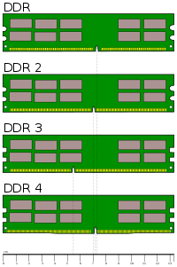

# Glosario

En general, la memoria del sistema se encarga de almacenar los datos, de
forma que esta esté accesible para la CPU. El sistema de memoria de los
ordenadores modernos consta de varias secciones con diferentes tareas:

  - La memoria de trabajo o RAM (Random Access Memory) es la memoria
    principal del ordenador que se puede leer y escribir con rapidez. Es
    volátil, es decir, pierde sus datos al apagar el ordenador. El
    tamaño de la memoria RAM en los ordenadores actuales se mide en
    megabytes o gigabytes.
  - La memoria caché. Es más rápida que la memoria RAM y se usa para
    acelerar la transferencia de datos. En ella se almacenan datos de la
    memoria principal a los que accederá el microprocesador
    próximamente. Justo antes de necesitar esos datos, se seleccionan y
    se colocan en dicha memoria. Ya vimos los tipos de caché L1, L2 y
    L3.
  - La memoria CMOS, que almacena datos de configuración física del
    equipo. Al ejecutar el programa Setup se pueden cambiar los datos
    almacenados allí.
  - La ROM o memoria de solo lectura (Read Only Memory). Aunque es solo
    de lectura, sí se puede modificar una o más veces, dependiendo del
    tipo de ROM. La BIOS de los ordenadores actuales está grabada en una
    ROM (EEPROM), más conocida como Flash-ROM, que nos permitirá
    actualizarla.
  - La memoria gráfica o de vídeo. Dedicada a satisfacer las necesidades
    de la tarjeta gráfica. Muchas tarjetas gráficas la llevan integrada,
    pero otras de gama baja emplean parte de la memoria RAM para
    aplicaciones tales como los juegos 3D.

Algunos parámetros que hay que tener en cuenta en la memoria son:

  - La **velocidad**. Se mide en megahercios (MHz). Por ejemplo, si la
    velocidad de una memoria es de 800 MHz, significa que con ella se
    pueden realizar 800 millones de operaciones (lecturas y escrituras)
    en un segundo.
  - El **ancho de band** a o tasa de transferencia de datos. Es la
    máxima cantidad de memoria que puede transferir por segundo, se
    expresa en megabytes por segundo (MB/s) o en gigabytes por segundo
    (GB/s).
  - *Dual/triple channel*. Permite a la CPU trabajar con dos/tres
    canales independientes y simultáneos para acceder a los datos. De
    esta manera se multiplica el ancho de banda. Para ello, es
    imprescindible rellenar los bancos de memoria con dos o tres módulos
    de idénticas características.
  - **Tiempo de acceso**. Es el tiempo que tarda la CPU en acceder a la
    memoria. Se mide en nanosegundos (un nanosegundo = 10–9 segundos).
  - **Latencia**. Es el retardo producido al acceder a los distintos
    componentes de la memoria RAM.
  - **Latencias CAS o CL**. Indica el tiempo (en número de ciclos de
    reloj) que transcurre desde que el controlador de memoria envía una
    petición para leer una posición de memoria hasta que los datos son
    enviados a los pines de salida del módulo. Cuanto menor sea, más
    rápida será la memoria. A veces se abrevia como CL (Cas Latency) o
    CAS.
  - **ECC** (Error Checking and Correction). Todas las memorias RAM
    experimentan errores, debido a factores tales como fluctuaciones de
    energía, interferencias, componentes defectuosos, etc. Las memorias
    ECC son capaces de detectar y corregir algunos de estos errores.

# Tipos de RAM

Cuando ejecutamos un programa en el ordenador se pasa una copia de este
desde el almacenamiento secundario, que normalmente es el disco duro, a
la memoria RAM. Una vez en la memoria, las instrucciones que componen el
programa pasan a la CPU para su ejecución. ¿Por qué se utiliza la
memoria RAM? Porque puede transferir datos desde y hacia la CPU mucho
más rápido que los dispositivos de almacenamiento secundario. Si no
hubiese memoria RAM, todas las instrucciones y los datos se leerían de
la unidad de disco, lo que reduciría la velocidad de proceso del
ordenador. Los dos tipos básicos de memoria RAM utilizados en un
ordenador personal son la DRAM (memoria RAM dinámica) y la SRAM (memoria
RAM estática). Ambas almacenan datos e instrucciones, pero son bastante
diferentes y cada una tiene un propósito.

## Descripción de los tipos

### SRAM-RAM

Esta memoria,al ser estática, mantiene la información siempre que no se
interrumpa la alimentación. Las memorias SRAM ocupan más tamaño, tienen
menos capacidad y son más caras y rápidas que las DRAM. No se suelen
utilizar como memoria principal, sino como memorias cachés del
microprocesador y de la placa base.

### DRAM-RAM

Es la memoria principal de los ordenadores personales. Se la llama
dinámica porque su contenido se reescribe continuamente. Al ser la
memoria principal, la DRAM ha tenido que adaptarse para seguir el ritmo
de evolución de los microprocesadores y demás conjuntos de chips.
Veremos a continuación las tecnologías más comunes.

### SDRAM-DRAM

Se sincroniza con el reloj del sistema para leer y escribir en modo
ráfaga. Puede soportar velocidades de la placa base de 100 MHz y 133
MHz (más conocidas como PC100/PC133 SDRAM). La memoria SDRAM tiene un
ancho de bus de datos de 64 bits; en cada hercio (Hz) (o ciclo de reloj)
envía 64 bits (8 B). Calculamos los bytes que se envían por segundo a
100 y 133 MHz, o sea, la tasa de transferencia:

  - PC100: 8 bytes/Hz × 100 MHz = 800 MB/s.
  - PC133: 8 bytes/Hz × 133 MHz = 1066 MB/s.

Normalmente son suministradas en módulos DIMM de **168** pines con dos
ranuras.

### DDR SDRAM-SDRAM

Es una memoria de doble tasa de transferencia de datos que permite la
transferencia de datos por dos canales distintos simultáneamente en un
mismo ciclo de reloj. Supone una mejora con respecto a la SDRAM, ya que
consigue duplicar la velocidad de operación hasta los 200 MHz o 266 MHz.
Se la conoce más como DDR. Normalmente son suministradas en módulos DIMM
con **184** pines con una sola ranura.

### DDR2 SDRAM.

Supone una mejora con respecto a la DDR SDRAM, ya que funciona a más
velocidad y necesita menos voltaje, con lo que se reduce el consumo de
energía y la generación de calor. La tasa de transferencia de datos va
de 400 hasta 1 024 MB/s y permite capacidades de hasta 2 GB (por
módulo). La pega es que las latencias son más altas que en las DDR. Son
suministradas en módulos DIMM con **240** pines y una sola ranura.

### DDR3 SDRAM.

Esta supone una mejora con respecto a la DDR2 SDRAM: mayor tasa de
transferencia de datos, menor consumo debido a su tecnología de
fabricación y permite módulos de mayor capacidad, hasta 8 GB. También
tiene sus inconvenientes, las latencias son más altas que en las DDR2.
También son suministradas en módulos DIMM con **240** pines.

### DDR4 SDRAM

Los módulos de memoria DDR4 SDRAM tienen un total de **288** pines DIMM.
La velocidad de datos por pin, va de un mínimo de 1,6 Gb hasta un máximo
inicial de 3,2 Gb/s. ​ Las memorias DDR4 SDRAM tienen un mayor
rendimiento y menor consumo que las memorias DDR predecesoras. Tienen un
gran ancho de banda en comparación con sus versiones anteriores.

### VRAM (Video Random Access Memory).

Es un tipo de memoria RAM utilizada por la tarjeta gráfi ca para poder
manejar la información visual que le envía la CPU. Este tipo de memoria
permite a la CPU almacenar información en ella mientras se leen los
datos que serán visualizados en el monitor.

# Tipos de Módulos de Memoria RAM

## DIMM

Módulo de memoria en línea doble. El formato DIMM es similar al SIMM,
pero físicamente es más grande y tiene 168 contactos. Se distingue por
tener una muesca en los dos lados y otras dos en la fila de contactos.
Se monta en los zócalos de forma distinta a los SIMM. Existen módulos
DIMM de 32, 64, 128, 256 y 512 Mb y de 1, 2 o más gigabytes.

## DIMM DDR

Los módulos DIMM DDR han sustituido a los módulos DIMM estándar. Estos
vienen con 184 contactos. Los módulos de memoria parecen iguales, pero
los DIMM DDR tienen una única muesca en la fila de contactos. Los
módulos DIMM DDR2 tienen 240 pines y una muesca en una posición
diferente a los DIMM DDR. También las ranuras donde se insertarán los
módulos de memoria son diferentes. Los módulos DIMM DDR3 tienen el
mismo número de pines que los DIMM DDR2, pero son física y
eléctricamente incompatibles

## FB-DIMM *(Fully Buffered DIMM)*

La módulos de memoria FB-DIMM se suelen utilizar en servidores. Los
datos entre el módulo y el controlador de memoria se transmiten en
serie, con lo que el número de líneas de conexión es inferior; esto
proporciona grandes mejoras en cuanto a la velocidad y a la capacidad de
la memoria. Tiene las desventajas de su elevado coste, el calor generado
debido al aumento de velocidad y el incremento de la latencia. Los
módulos FBDIMM tienen 240 pines, como los DDR2, pero la posición de sus
muescas es distinta.

## GDDR

Son chips de memoria insertados en algunas tarjetas gráficas o en placas
base donde la tarjeta gráfica está integrada. Son memorias muy rápidas,
controladas por el procesador de la tarjeta gráfica. También se los
conoce como RAM DDR para gráficos.

## SO-DIM y Micro-DIMM

Son módulos DIMM de memoria para portátiles; el segundo tiene un formato
más pequeño que el primero. Los SO-DIMM para memorias DDR y DDR2 se
diferencian porque tienen la muesca en distinta posición.

## Módulos buffered y unbuffered

Los módulos **buffered** o registered tienen registros incorporados
(circuitos que aseguran la estabilidad a costa de perder rendimiento)
que actúan como almacenamiento intermedio entre la CPU y la memoria.
Este tipo de memoria aumenta la fiabilidad del sistema, pero también
retarda los tiempos de transferencia de datos entre esta y el sistema.

Se suelen usar sobre todo en servidores, donde es mucho más importante
la integridad de los datos que la velocidad. Los módulos registered se
distinguen de los unregistered por tener varios chips de pequeño tamaño.
Incluyen detección y corrección de errores (ECC).

Los módulos **unbuffered** o unregistered se comunican directamente con
el northbridge de la placa base. Esto hace que la memoria sea más
rápida, aunque menos segura que la registered.

# Ejercicios

Realizar todos los ejercicios en un fichero *PDF* y copiar el enunciado
antes de contestar.

## Ejercicio 1

¿Qué es la memoria *SWAP*? Explica cómo funciona en GNU/LinuX si estamos
usando una partición y cómo funciona si estamos usando un Fichero.

## Ejercicio 2

En los sistemas Windows, el fichero de SWAP se aloja en `PAGEFILE.SYS`,
describe cómo podríamos cambiarlo.

## Ejercicio 3

Elabora una tabla compartiva de los voltajes a los que funcionan los
diferentes módulos de RAM que hemos visto.

## Ejercicio 4

El comando `free` nos muestra la cantidad de memoria usada y libre en el
sistema.

Leyendo su página de manual (`man free`), contesta a las siguientes
preguntas:

  - ¿Cómo obtendríamos el estado de la RAM cada 3 segundos?
  - ¿Y si lo quisiéramos con los totales expresados en *mebibytes*?
  - ¿Qué significa el uso del parámetro `-h`?
  - ¿Qué hace el argumento `--si`?¿Porqué es necesario?
