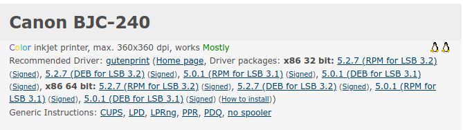

# Tarea : OpenPrinting

Hemos visto al configurar el CUPS que es necesario proporcionar un driver para que la Impresora funcione de manera correcta. En los sistemas GNU/LinuX ese driver es un pequeño fichero de texto plano que contiene información acerca de la impresora y de como CUPS ha de comunicarse con ella, así como los diferentes parámetros que acepta.

Vamos a repasar algunos conceptos y hacemos agunas prácticas.

Realizar todo en un documento y lo subís a la plataforma. El nombre del fichero ha de ser:

* `UD10_Tarea03_OpenPrinting_NombreAlumno.pdf`

## Ejercicio 1

¿Qué es un fichero de *text plano*, qué estamos queriendo indicar al usar ese adjetivo?.

## Ejercicio 2

[OpenPrinting](https://www.openprinting.org/) es una página Web que recoge muchísimos drivers y PPDS de impresoras de todos los fabricantes del Mundo, además nos indica *cuanto de bien* funcionan esas impresoras con sistemas GNU/LinuX (Y derivados).

Busca en la página las siguientes impresoras y realiza una captura de su *puntuación*.

Por ejemplo:

Si buscamos la impresora de marca Canon model BJC-240 , obtenemos esto:

\

Buscar las siguientes impresoras, adjuntar una foto de las mismas, y una descripción de sus características más importantes, así como una captura de OpenPrinting donde se muestre la compatibilidad del driver (como hemos visto arriba).

* Canon BJC-240
* Brother DCP-1200
* Brother HL-1850/70N
* Compaq IJ300
* HP Color LaserJet 4700
* Kyocera CS-2050
* Ricoh Aficio 1022

## Ejercicio 3 

De la impresora *Ricoh Aficio 1022* descargar el PPD de OpenPrinting y adjuntar las *Capacidades básicas del dispositivo* (**Basic Device Capabilities**), son 7 parámetros. Además, buscar en internet que significan cada uno de ellos y describirlos *con vuestras propias palabras*.

