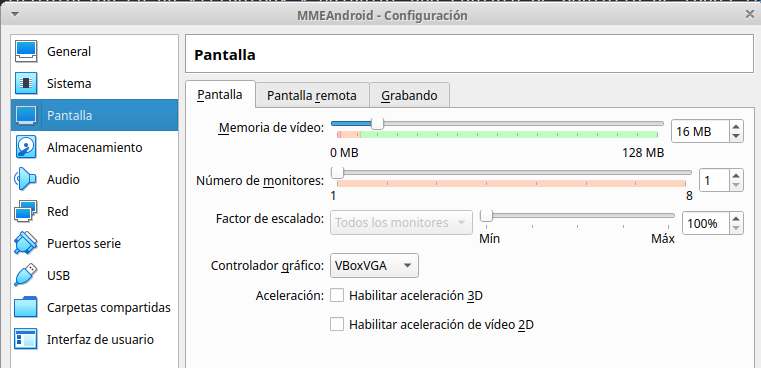

# Enunciado

Tal y como hemos visto en clase (que colgaré en *Aules* en breve), vamos a Instalar en VirtualBox un Android y a continuación le instalaremos las aplicaciones descritas en la tarea.

[Android x86](https://www.android-x86.org/)

# Tarea 01 : Instalando Android en VirtualBox

Realizar la instalación en un VirtualBox y adjuntar una captura de pantalla de todos los pasos que habéis seguido para ponerla en marcha en vuestra "Android Virtual". En cada uno de los pasos, describid qué estáis haciendo (**no** me vale el Siguiente -> Siguiente ->Siguiente.), describid con vuestras palabras en qué consiste el paso y porqué es necesario.

Soy consciente de que hay muchos pasos que no sabréis, pero estoy seguro de que no os rendiréis.

La máquina ha de llamarse: *MMEAndroid*.

Atentos al driver gráfico del VirtualBox que debe ser:

**VBoxVGA**

\

| Item | Hasta *x* Puntos |
|------|------------------|
| Detalles del proceso     | 4 |
| Explicación de los pasos | 4 |
| Orden y cuidado          | 2 |

# Tarea 02 : Instalación via market (Store) de las siguientes aplicaciones

* Pou
* Mocha Wol
* E/S file explorer
* *Editor de texto para la terminal*
* Antennapod

Adjuntar captura de cada una de ellas lanzada y en funcionamiento.

