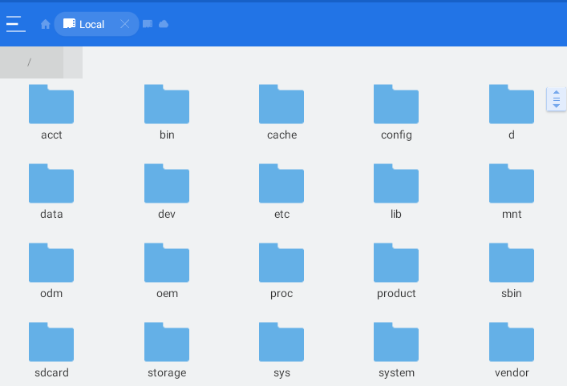
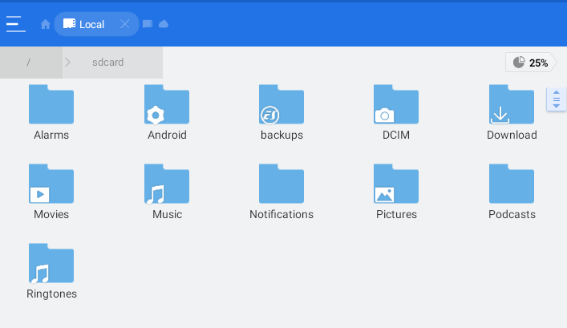

# Enunciado

Tal y como hemos visto en clase (que colgaré en *Aules* en breve), vamos a Instalar en VirtualBox un Android y a continuación le instalaremos las aplicaciones descritas en la tarea.

[Android x86](https://www.android-x86.org/)

Para la realización de esta tarea debemos contar con el Android x86 que se ha pedido en tareas anteriores.

# Tarea 01 : Carpetas más importantes.

En esta tarea se trata de identificar y explicar para qué sirven y qué contienen las carpetas de nuestro SO Android recién instalado.

\

| Item | Hasta *x* Puntos |
|------|------------------|
| Hasta 5 carpetas explicadas    | 5 |
| De 5 a 10 carpetas explicadas  | 7 |
| Todas                          | 10 |

De cada una de las carpetas debéis describir qué contiene y para que sirve: Ejemplo:

## sdcard 

Contiene diferentes carpetas como las que se muestran en la imágen:

\

Que contienen los datos relativos a los ficheros de audio/vídeo/imágen que se almacenan en el almacenamiento *externo*  (típicamnente la tarjeta SD). 

Se trata de una carpeta que puede ser borrada sin peligro para el Sistema Operativo, si previamente se ha realizado un backup de todo su contenido, ya que las fotos y los vídeos suelen ser los datos más valiosos que almacena un móvil.

Esto sería un ejemplo.