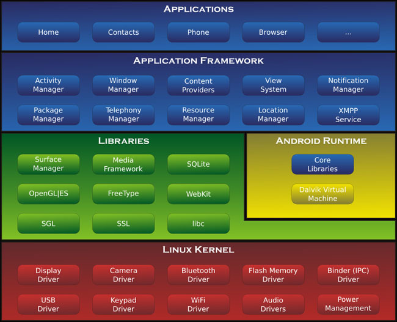

# Enunciado

En esta tarea vamos a comprender un poco mejor cómo funciona Android, ya que parece ser el SO más utilizado en el mundo actualmente (2020). Es importante que tengáis en cuenta que Android es GNU/LinuX ( es decir, se basa en el) pero se adapta a determinadas características que son necesarias, o que han surgido de los estándares de la Industria, para poder dar soporte a todo el ecosistema de _Smartphones_ que existe hoy en dia.

## Tarea 01 : Historia de Android

Las versiones de Android vienen indicadas con un dulce. Rellena una tabla con las diferentes versiones hasta la fecha (incluyendo la que vendrá), indicando:

| Número de version | Nombre en clave | Fecha de lanzamiento |
|-------------------|-----------------|----------------------|

## Tarea 02 : Sistemas y subsistemas

Supongo que ya comenzaréis a daros cuenta de que esto de la Informática y sus Sistemas es un universo bastante complejo. Hace muchos años se decidió que la comprensión de **todo** como un único concepto es algo que queda fuera de los límites de la comprensión humana, debido a su enorme tamaño y complejidad. Por ello se comenzaron a desarrollar partes más pequeñas, que resolvían problemas y encapsulaban la complejidad, actuando de _cajas negras_, es decir de código que resuelve un problema, sin necesidad de saber exactamente como funciona, por las capas superiores y los usuarios.

Android usa esto (al igual que otros SO) y aquí tenéis un ejemplo de Sistema modular:

\

Describid todos los módulos que aparecen en la imágen. Buscad información acerca de para qué sirve (cual es su función). Parece mucho, pero no lo es tanto. 

Describidlo con vuestras propias palabras. Además os aconsejo que os vayáis haciendo un glosario de palabras .