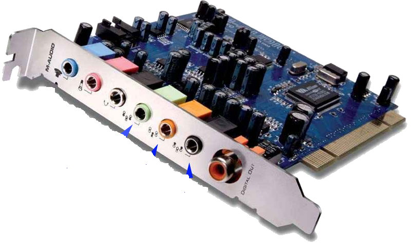
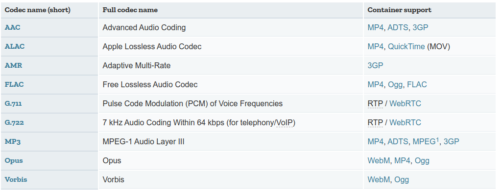

# Enunciado

Tal y como hemos visto en clase existen multitud de formatos y algoritmos de compresión tanto para audio como para vídeo. Vamos a realizar ahora una serie de tareas que nos permitirán profundizar más en cómo funciona todo el tema de multimedia, y los requisitos que son necesarios para configurar los periféŕicos.

Enlaces de interés:

 * https://developer.mozilla.org/en-US/docs/Web/Media/Formats/Audio_codecs
 * https://developer.mozilla.org/en-US/docs/Web/Media/Formats/Video_codecs
 * https://developer.mozilla.org/en-US/docs/Web/Media/Formats/Audio_concepts
 * https://developer.mozilla.org/en-US/docs/Web/Media/Formats/Video_concepts

Para la resolución de las tareas debéis utilizar las Webs que os adjunto, no *vale* buscarlo en Internet. Y sé que  están en Inglés. ^_^

## Tarea 01 : Contenedores y Códecs 

¿Qué es un contenedor? ¿Qué es un códec? ¿Qué diferencia hay?

## Tarea 02 : Audio - LFE

¿Qué es un canal con **Low Frequency Enhancement**? ¿A qué dispositivos va dirigido? ¿Qué salida de la siguiente tarjeta lo tendría?

\

## Tarea 03 : Audio - Frecuencias

¿Qué indica una frecuencia en el Audio si hablamos de *sample rates*? Utilizando la Web indicada, rellena la siguiente tabla:

| Frecuencia | Uso |
|------------|-----|
| 8000 Hz    |     |
| 44100 Hz   |      |
| 48000 Hz   |      |
| 96000 Hz   |      |
| 192000 Hz  |      |

## Tarea 04 : Audio - Codecs

¿Qué es la latencia si estamos hablando de codecs de audio?.

De la siguiente tabla:

\

Indica cuáles de ellos tienen una latencia de menos de 40ms.
