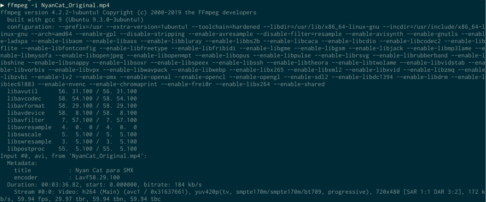

# Enunciado

Tal y como hemos visto en clase existen multitud de formatos y algoritmos de compresión tanto para audio como para vídeo. Vamos a realizar ahora una serie de tareas que nos permitirán profundizar más en cómo funciona todo el tema de multimedia, y los requisitos que son necesarios para configurar los periféŕicos.

{ width=50% }
\

Enlaces de interés:

* https://www.ostechnix.com/20-ffmpeg-commands-beginners/
* Vídeo del Nyan Cat que encontraréis en la plataforma.
* Clase del 24 de Abril de 2020 (Aules).

|*Aviso Navegantes*|
|------------------|
| Todas las tareas que requieran de la ejecución de un comando, ya sea en Windows,GNU/LinuX,Android,... además de lo que se pida en la tarea, debe adjuntar el comando que se debe utilizar para su solución.|

## Tarea 01 : Obteniendo información de  un Fichero

Usando el FFMPEG que habéis instalado, obtener información de los diferentes códecs e info relativa al vídeo de NyanCat que os adjunto.
Realizad una captura de pantalla del resultado y adjuntarla como solución.

\

## Tarea 02 : Convirtiendo a avi.

Usando el FFMPEG que habéis instalado. Transformad el fichero a *.avi*. ¿Ocupa más o menos que el original?. Adjuntad captura del proceso de conversión. 

## Tarea 03 : Ocultando info del comando.

Como ya os habréis dado cuenta, una gran parte de la *salida* del comando en la terminal es "información no útil", ya que habla de los parámetros de `ffmpeg`, para ocultarla a partir de esta tarea ejecutar siempre los comandos con `-hide_banner` como argumento.

## Tarea 04 : Extrayendo la pista de audio.

Vamos a crear ahora el fichero `.ogg` del NyanCat que contendrá *solo* la música, para ello ejecutad:

* `ffmpeg -i tuFicheroVaAqui.mp4 -vn nyanCatSoloMusica.ogg`

Comprobar mediante el VLC que todo está correcto. 

Adjuntar captura del proceso.

## Tarea 05 : Re-escalando el video.

Si ejecutamos el comando : 

* `ffmpeg -i input.mp4 -filter:v scale=1280:720 -c:a copy output.mp4`

Tal y como aparece en la Web que hemos visto, realiza un escalado del vídeo. Realizad los cambios necesarios en el comando para que escale a *1920x1080* vuestro NyanCat y lo guarde como : `NyanCat_FULLHD.mp4`.

## Tarea 06 : Transformándolo en una película muda.

Transforma el Video del NyanCat a "*mudo*". Adjunta el comando que has utilizado, así como el resultado de su ejecución.

## Tarea 07 : Cortando el NyanCat.

Realiza un corte de 25 segundos a partir del minuto 1'22. El *Clip* debe contener audio y video en formato avi.

## Tarea 08 : Cambiando música.

Utilizando ffmpeg (como el resto de ejercicios), cambia la pista de audio del NyanCat por otra que te guste a ti. Si debes cortar la pista de audio nueva, indícalo y adjunta el comando y su captura.

## Tarea 09 : Resumen

Enviadme todos los videos y audios generados y comprimidos.

En un único zip. 

