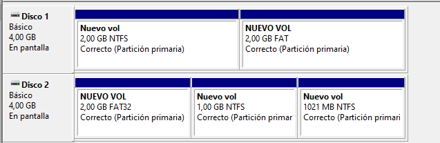
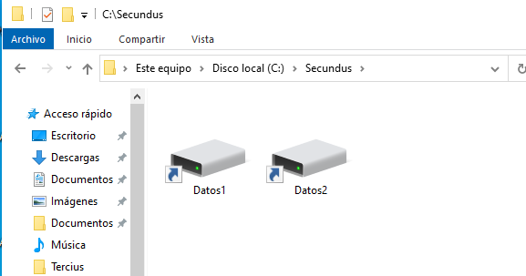
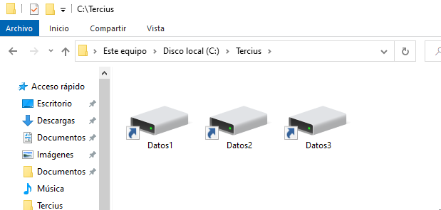

# Particionando desde la línea de comandos

Para la realización de este último exámen vamos a realizar una serie de operaciones que nos permitirán 
la puesta en marcha y utilización de discos duros dentro de un S.O.

Las prácticas que se van a realizar deben ejecutarse tal y como se pide, con los nombres que se piden y las rutas exactas.

**LEER TODO EL EJERCICIO ANTES DE EMPEZAR A HACERLO** 

**No es un examen difícil**, pero si que exige que estemos atentos a todo lo que debemos hacer, hemos hecho estos pasos más de 10 veces este curso...

## Ejercicio 00 - 0 Puntos (Requisito)

Debéis tener 2 máquinas virtuales preparadas y recién instaladas: 

 * 1 * Windows 10. (1 DiscoDuro de 50GB).
 * 1 * Xubuntu 20.04 (1 DiscoDuro de 15GB).

Ambas máquinas conectadas por NAT a la red y con usuarios conocidos por el alumnado. 
Recomiendo crearlas de *0* para evitar problemas en este último exámen del curso.

Esta parte del examen estará disponible antes de la realización del mismo.

## Ejercicio 01 : GNU/LinuX - 4 Puntos 

En la máquina de Xubuntu 20.04 añadiremos 2 discos duros de tamaños:

| Id. Disco  | Tamaño | Nombre del Fichero |
|------------|--------|--------------------|
| *sdb*	     | 6 GB   | LinuxSecundus.vdi  |
| *sdc*      | 9 GB   | LinuxTercius.vdi   | 

Los nombres de los discos indican el orden en el que deben quedar añadidos (conectores SATA).

Particionaremos los discos de la siguiente manera:

| Partición | Tamaño | Tipo | Punto de Montaje |
|-----------|--------|------|------------------|
| /dev/sdb1 | 1GB    | ext3 | /secundus/primaris |
| /dev/sdb2 | 2GB    | ext4 | /secundus/secundus |
| /dev/sdb3 | 3GB    | fat32| /secundus/fatus |
| /dev/sdc1 | 4GB    | ntfs | /tercius/netus  |
| /dev/sdc2 | 5GB    | ext4 | /tercius/finalus |

Comprobarlo todo con el comando `mount` pero recordad que debe quedar todo establecido en el fichero:
 
`/etc/fstab`

 *Tal y como hemos visto muchas veces en clase*.

Realizar la comprobación de :

`mount -a` 

para ver que todo funciona y reiniciar el Sistema.

### Entrega:

 * Una captura de la MV donde se muestren los detalles de los discos duros conectados.
 * Una captura de la MV arrancada y la salida del comando: 
	`mount | grep -e sda -e sdb -e sdc`.
 * Una captura del fichero: `/etc/fstab`.

## Ejercicio 02 :  Windows - 3 Puntos

En la máquina de Windows 10 añadiremos 2 discos duros de tamaños:

| Tamaño | Nombre del Fichero |
|--------|--------------------|
| 4 GB   | WindowsSecundus.vdi  |
| 4 GB   | WindowsTercius.vdi   | 

Particionaremos los discos *mediante comandos* de de la siguiente manera:

| Disco - Partición | Tamaño | Tipo | Letra de acceso |
|-------------------|--------|------|------------------|
| Disco1 Particion1 | 2GB    | ntfs | S: |
| Disco1 Particion2 | 2GB    | fat  | M: |
| Disco2 Particion1 | 2GB    | fat32 | T: |
| Disco2 Particion2 | 1GB    | ntfs | X: |
| Disco2 Particion3 | 1GB    | ntfs | Z: |

### Entrega:

 * Para cada partición, mostrar una captura con la ejecución de los comandos para realizarlo.
 * Una vez finalizado todo, una captura del Explorador de archivos mostrando las diferentes unidades.

## Ejercicio 03 : Conceptos Avanzados - 3 Puntos

Modifica las particiones del ejercicio 2 (Windows) para que se monten en la siguiente estructura de carpetas, deberás crearlas antes:

 * `C:\Secundus\Datos1`
 * `C:\Secundus\Datos2`
 * `C:\Tercius\Datos1`
 * `C:\Tercius\Datos2`
 * `C:\Tercius\Datos3`

\

\

\

## Ejercicios 02 y 03 - Alternativos : Windows - 6 Puntos

En previsión de que no funcione una MV con Windows, esta parte del examen se puede realizar utilizando una memoria USB externa.

*IMPORTANTE* : Los datos que hayan en el USB se van a perder, así que se debe guardar/revisar antes de comenzar el examen.

Conectar un USB y realizar un particionado de la siguiente manera:

| Disco - Partición | Tamaño | Tipo | Letra de acceso |
|-------------------|--------|------|------------------|
| Particion1 | 20% Total    | ntfs | S: |
| Particion2 | 20% Total    | fat  | M: |
| Particion3 | 10% Total    | fat32 | T: |
| Particion4 | 20% Total    | ntfs | X: |
| Particion5 | 30% Total    | ntfs | Z: |

### Entrega:

 * Para cada partición, mostrar una captura con la ejecución de los comandos para realizarlo.
 * Una vez finalizado todo, una captura del Explorador de archivos mostrando las diferentes unidades.

Modifica las particiones del ejercicio 2 (Windows) para que se monten en la siguiente estructura de carpetas, deberás crearlas antes:

 * `C:\Secundus\Datos1`
 * `C:\Secundus\Datos2`
 * `C:\Tercius\Datos3`
 * `C:\Tercius\Datos4`
 * `C:\Tercius\Datos5`

*Datos1 - Datos5 son las 5 particiones realizadas anteriormente*.

\

\

\

### Entrega:

 * Muestra una captura del Administrador de Discos donde se muestren las diferentes particiones.
 * Una vez finalizado todo, una captura del Explorador de archivos mostrando las diferentes unidades.

