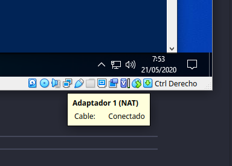
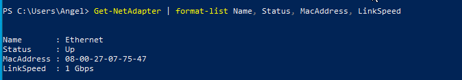

# Exámen: Red Básica en Windows

Utilizando los conceptos que hemos visto en teoría ( y los comandos), realiza los siguientes ejercicios mediante el VirtualBox y una máquina virtual en Windows, cambiando la **configuración** de la RED de la MV. 

*Aviso Navegantes: Tras cada cambio de la configuración de la red, aconsejo reiniciar la MV para comprobar de manera adecuada los comandos.*

En cada uno de los ejercicios se indica en que modo debe estar la configuración de la red para la realización del mismo.

Sobre cada ejercicio se pide:

 * Comandos ejecutados para su objetivo.
 * Comentarios sobre lo hecho.

El propósito de este *exámen* es saber si sabeis, si os copiais lo sabré y la nota os la podéis imaginar, tenéis todo el fin de semana y mañana para hacerlo. Yo estaré en clase el viernes de 11 a 12 para dudas. El exámen es largo y tiene mucho texto, pero si os lo tomáis con calma veréis que es mucho más sencillo de lo que parece.

## Ejercicio 0 (Resuelto a modo de Ejemplo)

### Modo de Red

Estableciendo la conexión a **NAT**

### Comandos y comprobaciones

* Obtener los dispositivos de red en formato Lista, indicando para cada uno de ellos:
  * Nombre
  * Estado
  * Dirección MAC
  * Velocidad de Conexión
  
### Preguntas asociadas

  * ¿Podemos encontrar MAC repetidas en una máquina?
  * ¿Y en una red?
  * ¿Y en Internet?
  * ¿Cómo se asignan? Busca un ejemplo.

### Solución a presentar

Establecemos la conexión de la red a NAT en la máquina virtual, para mostrarlo, nos situamos en la parte inferior del VirtualBox en el icono de la red y aparecerá un *tooltip* que indica su estado.

Adjuntamos captura de la configuración de la red:


\

Una vez realizada esta comprobación, en una terminal de *PowerShell*, ejecutamos el comando siguiente:

```powershell
    Get-NetAdapter | Format-List Name, Status, MacAddress, LinkSpeed
```

Salida del comando:


\

### Preguntas

  *¿Podemos encontrar MAC repetidas en una máquina?*

  No, ya que se trata de un identificador único asociado al Hardware de Conexión a la red.

  *¿Y en una red?*
  
  Esta ya la contestais vosotr@s...

\newpage

## Ejercicio 1

### Modo

Estableciendo la conexión a **NAT**

### Comandos y Comprobaciones

* Obtener en formato Lista :
  * IP del Adaptador.
  * IP de la Puerta de Enlace
  * IP del Servidor/es DNS

### Preguntas asociadas

  * ¿Podemos tener varias máquinas *arrancadas* en VirtualBox con esa misma IP?
  * ¿Puedes hacer `Test-NetConnection` (aka. *ping*) a tu máquina anfitriona?. 

\newpage
## Ejercicio 2

### Modo

Estableciendo la conexión a **Adaptador Puente**

### Comandos y Comprobaciones

* Obtener en formato Lista :
  * IP del Adaptador.
  * IP de la Puerta de Enlace
  * IP del Servidor/es DNS
  * Tiempo de la concesión DHCP.

### Preguntas asociadas

  * ¿Podemos tener varias máquinas *arrancadas* en VirtualBox con esa misma IP?
  * ¿Puedes hacer `Test-NetConnection` (aka. *ping*) a tu máquina anfitriona?. 
  * ¿Puedes hacer `Test-NetConnection` (aka. *ping*) a tu Router de Casa?

\newpage
## Ejercicio 3

### Modo

Estableciendo la conexión a **NAT** , realizar una conexión con Traza de la Ruta hasta `youtube.es` y mostrar:

### Comandos y Comprobaciones

* Obtener en formato Lista:
  * Nombre del Servidor
  * IP del Servidor.
  * Ruta de la resolución DNS.

### Preguntas asociadas

  * ¿Qué significan los saltos cuyas IP son 0.0.0.0?
  * ¿Qué servidores DNS me tengo que saber de memoria?
  * ¿Porqué no puedo contar con buscar el nombre de los servidores DNS en vez de poner las IPs de los mismos?
