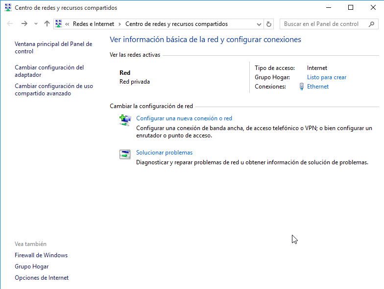
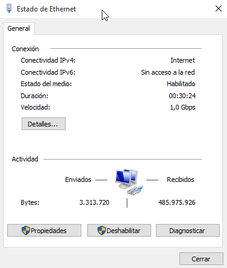
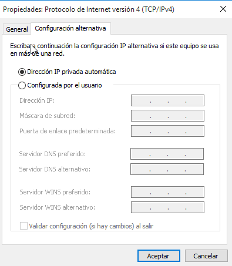
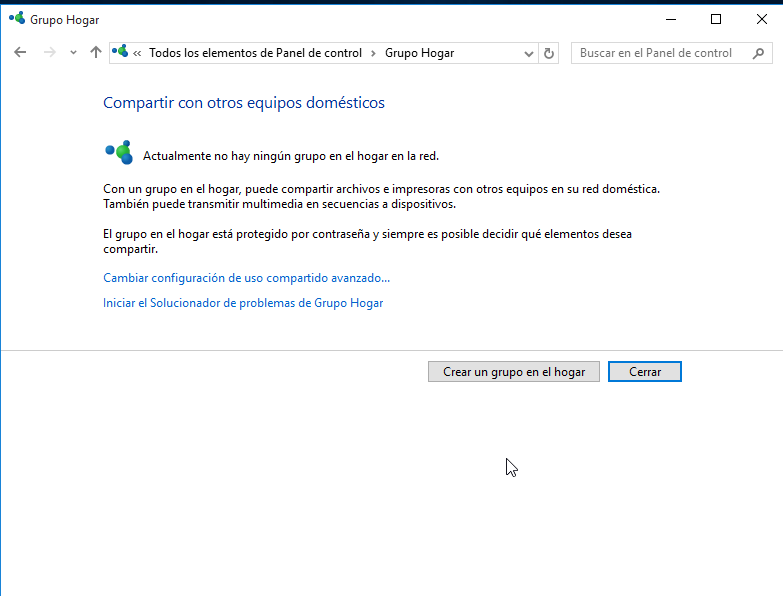

---
title: Unidad 12 - Mantenimiento - Características de una Máquina
author: Angel Berlanas Vicente
header-includes: |
lang: es-ES
keywords: [SMX, MME]
---

\newpage

## Red Básica en Windows 10

Para realizar la configuración de la red en Windows 10, lo más cómodo desde la interfaz de usuario es ir al centro de redes y recursos compartidos que podemos encontrar en el panel de control.

\ 

### Estado de una conexión

Si vemos el estado de la tarjeta de red ethernet se nos muestra un pequeño diálogo donde podemos observar el tráfico y configuración de la red de manera sencilla. Esto se aplica también
a tarjetas de red inalámbricas, 3G, 4G... 

\ 

### Conexión:

 * *Conectividad IPv4*: Esto nos muestra si estamos conectados a una red de tipo **IPv4**.
 * *Conectividad IPv6*: Esto nos muestra si estamos conectados a una red de tipo **IPv6**.
 * *Estado del medio*: Indica si tenemos el dispositivo habilitado
 * *Duración* : Tiempo que lleva el dispositivo habilitado.
 * *Velocidad* : Velocidad (Tasa) de transferencia a la que se ha negociado con el adaptador.
 
### Actividad:

 Aquí se muestran los bytes enviados y recibidos por la conexión, es un buen indicador del estado de la conexión.

>**NOTA** : Si tenemos una conexión que tan solo incrementa el número de bytes enviados. ¿Qué es lo que puede estar ocurriendo?.

### Detalles de la conexión de red

En el botón de detalles de la captura anterior (Estado de Ethernet), se muestran todos los detalles que el sistema puede obtener de un determinado adaptador.

\ 

### Configuración de la red

Trataremos la configuración de la red mediante IPv4, ya que la configuración con IPv6 por ahora no está tan extendida y lo más habitual es configurar los dispositivos dentro de una red de area local.

\ 

Debemos tener seleccionado la opción **Protocolo de Internet version 4(TCP/IPv4)** y entonces al pulsar en el botón **Propiedades** nos permitirá configurar la tarjeta 
de red, tanto si queremos una dirección IP fija, si queremos *DHCP* o si queremos un modo híbrido, que consiste en pedir IP por DHCP y si ningún servidor DHCP nos contesta
en la concesión entonces usamos la IP que se ha establecido a modo de *plan B*. Esto puede ser muy útil en el caso de que el equipo pertenezca a una red con reserva
y el servidor DHCP no se la asigna por cualquier motivo, se la establecemos *a mano*.

\ 

\ 

### Grupos de Trabajo y dominios en Windows

Los equipos que ejecutan Windows en una red deben formar parte de un dominio o grupo de trabajo.
Los equipos que ejecutan Windows en redes domésticas también pueden formar parte de un grupo en el hogar, aunque es opcional.

La pertenencia a un grupo en el hogar facilita el uso compartido de archivos e impresoras en una red doméstica.
Generalmente, los equipos de redes domésticas forman parte de un grupo de trabajo y, probablemente, de un grupo en el hogar,
y los equipos de redes del lugar de trabajo forman parte de un dominio.

**Nota**
No todas las versiones de Windows permiten unir el equipo a un dominio, antes de realizar la instalación hay que comprobar
que la versión que instalaremos nos permita realizar la _unión al dominio_.

**Dominio**

Un dominio es un grupo de equipos de una red que comparten una base de datos y una directiva de seguridad comunes. Un dominio se administra como una unidad con reglas y procedimientos comunes, y cada dominio posee un nombre único.
Uno o más equipos son servidores. Los administradores de red utilizan los servidores para controlar la seguridad y los permisos de todos los equipos del dominio. Esto facilita que los administradores puedan realizar cambios, ya que estos se aplican automáticamente a todos los equipos. 
Los usuarios del dominio deben proporcionar una contraseña u otra información de inicio de sesión cada vez que accedan al dominio.
Si se dispone de una cuenta de usuario en el dominio, puede iniciar sesión en cualquier equipo del dominio sin necesidad de disponer de una cuenta en dicho equipo.
Este concepto lo veremos más adelante en el módulo de manera más detallada.

**Grupo de trabajo**

* Un grupo de trabajo es un grupo de equipos que están conectados a una red que no es un dominio y que comparten recursos, como impresoras y archivos. Cuando configura una red, Windows crea automáticamente un grupo de trabajo y le da un nombre.
* Todos los equipos son del mismo nivel; ninguno tiene control sobre otro equipo.
* Cada equipo tiene un conjunto de cuentas de usuario. Para iniciar sesión en cualquier equipo del grupo de trabajo, se debe tener una cuenta en ese equipo.
* Normalmente, no hay más de veinte equipos.
* Un grupo de trabajo no está protegido con contraseña.
* Todos los equipos deben encontrarse en la misma red o subred.

**En un grupo en el hogar**

* Los equipos de una red doméstica deben pertenecer a un grupo de trabajo, pero también pueden pertenecer a un grupo en el hogar.
* Un grupo en el hogar permite compartir más fácilmente imágenes, música, vídeos, documentos e impresoras con otras personas de una red doméstica.
* El grupo en el hogar está protegido con contraseña, pero solo es necesario escribir la contraseña una vez, al agregar el equipo al grupo en el hogar.

\
